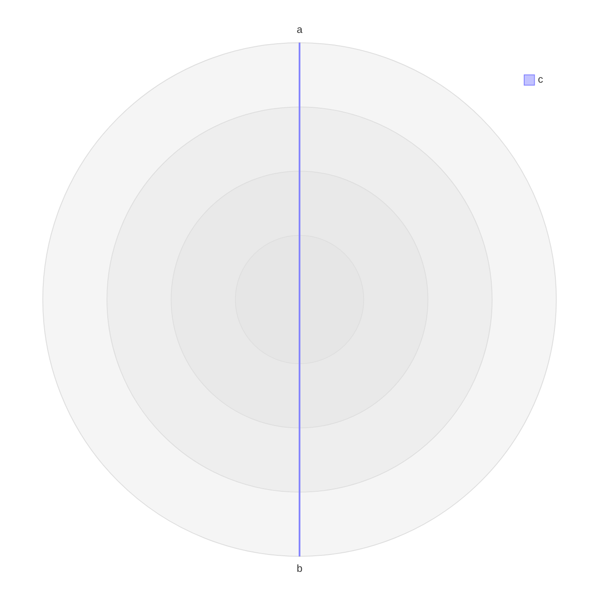

# Dependency and Vendored Runtime Security Upgrades Implementation Plan

> **For agentic workers:** REQUIRED SUB-SKILL: Use superpowers:subagent-driven-development (recommended) or superpowers:executing-plans to implement this plan task-by-task. Steps use checkbox (`- [ ]`) syntax for tracking.

**Goal:** Remove the known vulnerabilities hidden in shipped vendored bundles, make those bundles auditable, and then upgrade direct and vendored dependencies in isolated, evidence-backed batches.

**Architecture:** Treat npm workspaces and shipped vendored artifacts as separate dependency domains. Complete three security-critical vendor remediations first, add a version-aware OSV audit over the vendor registry, then advance tooling and renderer versions one independently reviewable batch at a time; Vditor and Lute remain isolated trials because they affect editor DOM and Markdown round-trip fidelity.

**Tech Stack:** npm lockfiles, Node ESM, TypeScript, Vitest, Playwright Chromium, `vscode-test-playwright`, esbuild, OSV query API, SHA-256-pinned browser bundles, Go/TinyGo WASM, Vditor, Lute.

**Spec:** `tasks/done/481-dependency-audit-triage.md`, refreshed by the approved 2026-08-28 root/webview/e2e/vendor audit; command authority is `DEVELOPMENT.md`, and Vditor-specific procedure is `docs/vditor-patch-checklist.md`.

## Global Constraints

- Use npm for repository dependency installation. A Markmap rebuild may use upstream's own pinned pnpm workspace only inside a temporary directory; it must not add a pnpm lockfile, `packageManager` field, or pnpm dependency to this repository.
- Keep `package-lock.json`, `media-src/package-lock.json`, and `test/vscode-e2e/package-lock.json` isolated. Never flatten the three workspaces.
- Never run `npm audit fix --force`; stop when a proposed fix crosses an unapproved major or engine floor.
- Preserve `engines.node: ">=22"` and `engines.vscode: "^1.110.0"` unless the Project Owner separately approves raising a compatibility floor.
- Keep `@types/node` on major 22. Pin `@types/vscode` to the supported VS Code 1.110 API surface instead of allowing its caret range to expose APIs newer than the declared engine floor.
- Every shipped vendor file must have immutable provenance, SHA-256 metadata, and shipped license/notice coverage through `media-src/vendor/vendored-assets.mjs`.
- Build with `node build.mjs` before every Chromium or real-VS-Code renderer check. Run browser and VS Code tests under `xvfb-run -a`; prefix real-VS-Code commands with `env -u ELECTRON_RUN_AS_NODE`.
- Any renderer/vendor behavior change needs unit coverage, Chromium coverage, and a written and run focused real-VS-Code spec. Chromium evidence does not substitute for the real webview.
- Lute changes must prove byte-stable Markdown round trips in IR and WYSIWYG, raw-text stability in SV, incremental/full serializer agreement, and host-prerender compatibility.
- Preserve all unrelated working-tree changes. `LOCAL_AGENT_TASK.md` stays untracked, unstaged, uncommitted, and unchanged.
- Create focused local commits only; never push, modify remotes, merge branches, or rewrite history.
- Version targets are the verified 2026-08-28 snapshot. Re-run `npm outdated`, npm audits, and vendor OSV queries before each batch; accept a newer patch only when it stays within the batch's declared compatibility boundary and the task file records the new evidence.

## Approved Version Boundaries

| Domain | Current | Approved target/boundary |
|---|---:|---:|
| Mermaid vendor | 11.15.0 | 11.17.2 |
| KaTeX Vditor asset | 0.16.9 | 0.16.47; stay on 0.16.x |
| Markmap bundle | markmap 0.18.12 + vulnerable linkify-it | markmap 0.18.12 rebuilt with markdown-it 14.3.0 and linkify-it 5.0.2 |
| Vditor | 3.11.2 | 3.11.3 isolated trial |
| Dagre | 3.0.0 | 3.1.1 isolated layout batch |
| Playwright webview | 1.60.0 | 1.62.1, matching the e2e harness |
| TypeScript | 7.0.2 | retain |
| jsdom | 29.1.1 | retain until its Node floor is compatible |
| D2 compiler | 0.1.33 | retain; npm release is current |

---

### Task 1: Open task 518 and capture the immutable baseline

**Files:**
- Create: `tasks/518-dependency-vendor-security-upgrades.md`
- Modify at final closure only: `tasks/README.md`

**Interfaces:**
- Produces: one status authority containing the exact before/after advisory counts, target versions, per-batch commits, verification commands, retries, and residual risks.
- Consumes: this plan and the current commands in `DEVELOPMENT.md`.

- [ ] **Step 1: Create the active task file before touching dependency or vendor bytes**

Use an unnumbered H1 and numbered lower headings. Record the three confirmed vendor findings separately from the clean npm-tree result:

```markdown
# Task 518 — dependency and vendored runtime security upgrades

> **Status:** active · **Impact:** security + dependency maintenance

## 1. Baseline

- npm root, media-src, and vscode-e2e audits: 0 known vulnerabilities on 2026-08-28.
- vendored Mermaid 11.15.0: affected by five advisories, four document-reachable.
- Vditor-supplied KaTeX 0.16.9: five advisories, including two document-reachable DoS paths.
- vendored Markmap 0.18.12: embeds linkify-it affected by two quadratic-complexity DoS advisories.
- 33/33 recorded vendor hashes match; 20/20 vendor registry entries have live consumers.
```

- [ ] **Step 2: Re-run the three npm advisory gates and save exact totals in the task**

Run:

```bash
npm run audit
npm run audit:vscode-e2e
npm audit signatures
npm --prefix media-src audit signatures
npm --prefix test/vscode-e2e audit signatures
```

Expected: all commands exit 0; each npm audit reports 0 vulnerabilities. Record signature and attestation counts without describing unattested packages as compromised.

- [ ] **Step 3: Re-run freshness and vendor integrity baselines**

Run:

```bash
npm outdated --json
npm --prefix media-src outdated --json
npm --prefix test/vscode-e2e outdated --json
node scripts/check-vendored-usage.mjs
npx vitest run --config test/vitest.config.ts test/backend/vendored-licenses.test.ts test/backend/mermaid-pin.test.ts test/backend/echarts-pin.test.ts test/backend/custom-diagrams-pin.test.ts test/backend/lute-pin.test.ts
```

Expected: `outdated` exits 1 with JSON while updates exist; vendor usage reports 20/20 live; focused pin/license tests pass.

- [ ] **Step 4: Commit the task authority alone**

```bash
git add tasks/518-dependency-vendor-security-upgrades.md
git diff --cached --name-only
git commit -m "task(518): track dependency and vendor security upgrades"
```

Expected staged path: only `tasks/518-dependency-vendor-security-upgrades.md`; `LOCAL_AGENT_TASK.md` is absent.

### Task 2: Upgrade the shipped Mermaid bundle to 11.17.2

**Files:**
- Modify: `media-src/vendor/mermaid/mermaid.min.js`
- Modify: `media-src/vendor/mermaid/source.json`
- Modify: `media-src/vendor/mermaid/NOTICE`
- Modify if upstream text changed: `media-src/vendor/mermaid/LICENSE`
- Modify: `test/backend/mermaid-pin.test.ts`
- Create: `test/vscode-e2e/fixtures/mermaid-security.md`
- Create: `test/vscode-e2e/mermaid-security.spec.ts`
- Modify: `tasks/518-dependency-vendor-security-upgrades.md`

**Interfaces:**
- Consumes: `media-src/scripts/fetch-mermaid.mjs <version>` and `patchMermaidVersion(code, version)` from `media-src/esbuild-shared.mjs`.
- Produces: SHA-pinned Mermaid 11.17.2 copied to `media/vditor/dist/js/mermaid/mermaid.min.js`; the Vditor loader cache-buster is derived from `source.json.version`.

- [ ] **Step 1: Make the pin test fail on the vulnerable version**

Add to `test/backend/mermaid-pin.test.ts`:

```ts
it('pins the advisory-clean Mermaid release approved by task 518', () => {
  expect(source.version).toBe('11.17.2')
})
```

- [ ] **Step 2: Run the pin and Vditor patch tests RED**

Run:

```bash
npx vitest run --config test/vitest.config.ts test/backend/mermaid-pin.test.ts test/backend/vditor-source-patches.test.ts
```

Expected: the new assertion fails with received version `11.15.0`; existing Vditor patch tests remain green.

- [ ] **Step 3: Re-pin through the repository fetcher**

Run:

```bash
node media-src/scripts/fetch-mermaid.mjs 11.17.2
```

Inspect `source.json`, `NOTICE`, license text, and `git diff --stat`. Do not edit the generated minified bundle manually.

- [ ] **Step 4: Add a focused real-VS-Code fixture for affected diagram families**

Create `test/vscode-e2e/fixtures/mermaid-security.md` with bounded, valid architecture, XY, and radar diagrams:

````markdown
```mermaid
architecture-beta
  group mermaidPrototypePollutionMarker(cloud)[Marker]
  service a(server)[A] in __proto__
  service b(server)[B] in mermaidPrototypePollutionMarker
  a:R -- L:b
```

```mermaid
xychart-beta
  x-axis [1, 2, 3]
  line [1, 2, 3]
```


````

- [ ] **Step 5: Write the real-webview security-family smoke**

In `test/vscode-e2e/mermaid-security.spec.ts`, open the fixture through `vscode.openWith`, wait for three `.language-mermaid svg` nodes, and assert no themed error box. Add a prototype-pollution guard around the architecture render:

```ts
const state = await frame.locator('body').evaluate(() => ({
  rendered: document.querySelectorAll('.language-mermaid svg').length,
  errors: document.querySelectorAll('.language-mermaid .vmarkd-diagram-error').length,
  polluted: Object.prototype.hasOwnProperty.call(
    Object.prototype,
    'mermaidPrototypePollutionMarker',
  ),
}))
expect(state).toEqual({ rendered: 3, errors: 0, polluted: false })
```

- [ ] **Step 6: Run focused GREEN gates**

Run:

```bash
npx vitest run --config test/vitest.config.ts test/backend/mermaid-pin.test.ts test/backend/vditor-source-patches.test.ts test/backend/vendored-licenses.test.ts
node build.mjs
xvfb-run -a npm --prefix media-src run test:e2e -- --grep mermaid
env -u ELECTRON_RUN_AS_NODE xvfb-run -a npm --prefix test/vscode-e2e test -- mermaid-security.spec.ts mermaid-error.spec.ts mermaid-c4-colors.spec.ts mermaid-style-scope.spec.ts
```

Expected: every command exits 0; no retry recovery is reported as a clean first-pass result.

- [ ] **Step 7: Commit the Mermaid security upgrade**

```bash
git add media-src/vendor/mermaid test/backend/mermaid-pin.test.ts test/vscode-e2e/fixtures/mermaid-security.md test/vscode-e2e/mermaid-security.spec.ts tasks/518-dependency-vendor-security-upgrades.md
git commit -m "fix(security): upgrade vendored Mermaid"
```

### Task 3: Make KaTeX an explicit 0.16.47 vendor tree

**Files:**
- Create: `media-src/scripts/fetch-katex.mjs`
- Modify: `media-src/vendor/katex/source.json`
- Create: `media-src/vendor/katex/NOTICE`
- Replace with upstream 0.16.47 text if changed: `media-src/vendor/katex/LICENSE`
- Create under `media-src/vendor/katex/dist/`: `katex.min.js`, `katex.min.css`, `contrib/mhchem.min.js`, and `fonts/*`
- Modify: `media-src/vendor/vendored-assets.mjs`
- Modify: `build.mjs`
- Modify: `media-src/esbuild-shared.mjs`
- Create: `test/backend/katex-pin.test.ts`
- Modify: `test/backend/vendored-licenses.test.ts`
- Modify: `test/backend/vditor-source-patches.test.ts`
- Create: `test/vscode-e2e/fixtures/katex-security.md`
- Create: `test/vscode-e2e/katex-security.spec.ts`
- Modify: `tasks/518-dependency-vendor-security-upgrades.md`

**Interfaces:**
- Extends `VENDORED_ASSETS` entries with optional `copyTree: Array<[sourceDir: string, destinationDir: string]>`.
- Produces `patchKatexVersion(code: string, version: string): string`, chained with `patchMathRender` for `vditor/src/ts/markdown/mathRender.ts`.
- Produces `source.json.components = [{ecosystem:'npm', name:'katex', version:'0.16.47'}]` for Task 5.

- [ ] **Step 1: Add failing registry and pin tests**

In `test/backend/katex-pin.test.ts`, assert:

```ts
expect(source.version).toBe('0.16.47')
expect(source.components).toEqual([
  { ecosystem: 'npm', name: 'katex', version: '0.16.47' },
])
expect(Object.keys(source.files)).toEqual(
  expect.arrayContaining([
    'dist/katex.min.js',
    'dist/katex.min.css',
    'dist/contrib/mhchem.min.js',
  ]),
)
```

Extend `vendored-licenses.test.ts` so every `copyTree` source directory exists and every regular file beneath it has a `source.json.files` SHA entry.

- [ ] **Step 2: Run focused tests RED**

Run:

```bash
npx vitest run --config test/vitest.config.ts test/backend/katex-pin.test.ts test/backend/vendored-licenses.test.ts
```

Expected: failure because the current KaTeX directory is license-only and `copyTree` is unsupported.

- [ ] **Step 3: Implement deterministic KaTeX fetching**

`fetch-katex.mjs` must `npm pack katex@0.16.47` into `fs.mkdtemp`, extract only the browser runtime files, hash each output, copy upstream license text, and write:

```json
{
  "package": "katex",
  "version": "0.16.47",
  "license": "MIT",
  "fetchedFrom": "npm pack katex@0.16.47",
  "components": [
    { "ecosystem": "npm", "name": "katex", "version": "0.16.47" }
  ],
  "files": {}
}
```

Populate `files` with normalized forward-slash paths and `{ "sha256": "..." }` values. Reject an archive whose `package.json.version` is not exactly `0.16.47`.

- [ ] **Step 4: Extend vendor syncing for one recursive tree**

Add `copyTree: [['dist', '']]` to the KaTeX entry. In `syncVendored`, recursively copy files from the declared source tree after each source file's recorded hash has been verified; reject symlinks and reject any copied file missing from `source.json.files`.

- [ ] **Step 5: Add the cache-buster patch**

Implement an anchor-asserted replacement over all three KaTeX URLs:

```js
export function patchKatexVersion(code, version) {
  const matches = code.match(/dist\/js\/katex\/(?:katex\.min\.(?:css|js)|mhchem\.min\.js)\?v=0\.16\.9/g) ?? []
  if (matches.length !== 3) {
    throw new Error('patchKatexVersion: expected three KaTeX 0.16.9 URLs (version drift?)')
  }
  return code.replace(/(dist\/js\/katex\/(?:katex\.min\.(?:css|js)|mhchem\.min\.js)\?v=)0\.16\.9/g, `$1${version}`)
}
```

Chain `patchKatexVersion(patchMathRender(code), katexPin.version)` in the existing math-render registry entry and test all three rewritten URLs against the real vendored Vditor source.

- [ ] **Step 6: Fetch and verify the new vendor tree**

Run:

```bash
node media-src/scripts/fetch-katex.mjs 0.16.47
npx vitest run --config test/vitest.config.ts test/backend/katex-pin.test.ts test/backend/vendored-licenses.test.ts test/backend/vditor-source-patches.test.ts
```

Expected: hashes, license metadata, tree coverage, and cache-busters pass.

- [ ] **Step 7: Add real-webview math coverage**

The fixture must contain inline math, display math, `mhchem`, a macro, malformed input, and literal `\\edef` text that is rejected/rendered without blocking. The spec must assert rendered `.katex` nodes, one themed error for malformed input, and a responsive page using an `expect.poll` heartbeat after all blocks settle.

- [ ] **Step 8: Run focused renderer verification**

Run:

```bash
node build.mjs
npx vitest run --config test/vitest.config.ts test/backend/katex-pin.test.ts test/backend/vditor-source-patches.test.ts test/backend/assets.test.ts
xvfb-run -a npm --prefix media-src run test:e2e -- --grep 'math|KaTeX'
env -u ELECTRON_RUN_AS_NODE xvfb-run -a npm --prefix test/vscode-e2e test -- katex-security.spec.ts parity.spec.ts mode-switch-parity.spec.ts
npm run check:bundle-size
```

- [ ] **Step 9: Commit the explicit KaTeX pin**

```bash
git add media-src/scripts/fetch-katex.mjs media-src/vendor/katex media-src/vendor/vendored-assets.mjs build.mjs media-src/esbuild-shared.mjs test/backend/katex-pin.test.ts test/backend/vendored-licenses.test.ts test/backend/vditor-source-patches.test.ts test/vscode-e2e/fixtures/katex-security.md test/vscode-e2e/katex-security.spec.ts tasks/518-dependency-vendor-security-upgrades.md
git commit -m "fix(security): pin patched KaTeX runtime"
```

### Task 4: Rebuild Markmap 0.18.12 with fixed linkification

**Files:**
- Modify: `media-src/scripts/fetch-markmap.mjs`
- Modify: `media-src/vendor/markmap/markmap.min.js`
- Modify: `media-src/vendor/markmap/source.json`
- Modify if generated attribution changes: `media-src/vendor/markmap/LICENSE`
- Modify: `test/backend/custom-diagrams-pin.test.ts`
- Create: `test/backend/markmap-security.test.ts`
- Create: `test/vscode-e2e/fixtures/markmap-security.md`
- Create: `test/vscode-e2e/markmap-security.spec.ts`
- Modify: `tasks/518-dependency-vendor-security-upgrades.md`

**Interfaces:**
- Consumes immutable Markmap commit `205367a24603dc187f67da1658940c6cade20dce` for release 0.18.12.
- Uses an upstream-only temporary pnpm workspace with overrides `markdown-it: 14.3.0` and `linkify-it: 5.0.2`.
- Produces `source.json.components` entries for `markmap-lib`, `markmap-view`, `markdown-it`, `linkify-it`, and `d3`.

- [ ] **Step 1: Add failing provenance and vulnerable-signature tests**

In `test/backend/markmap-security.test.ts`:

```ts
expect(source.build.sourceCommit).toBe(
  '205367a24603dc187f67da1658940c6cade20dce',
)
expect(source.components).toContainEqual({
  ecosystem: 'npm',
  name: 'linkify-it',
  version: '5.0.2',
})
expect(js).not.toContain(
  `re.src_email_name = '[\\\\-;:&=\\\\+\\\\$,\\\\.a-zA-Z0-9_][\\\\-;:&=\\\\+\\\\$,\\\\"\\\\.a-zA-Z0-9_]*'`,
)
```

- [ ] **Step 2: Run security tests RED**

Run:

```bash
npx vitest run --config test/vitest.config.ts test/backend/markmap-security.test.ts test/backend/custom-diagrams-pin.test.ts
```

Expected: failure because current metadata lacks nested components and the bundle contains the affected unbounded email regex.

- [ ] **Step 3: Replace prebuilt-download mode with a reproducible source rebuild**

Update `fetch-markmap.mjs` to:

1. create a temporary directory;
2. download/extract the GitHub archive at commit `205367a24603dc187f67da1658940c6cade20dce`;
3. patch only the temporary workspace root with pnpm overrides for `markdown-it@14.3.0` and `linkify-it@5.0.2`;
4. run `corepack pnpm install --frozen-lockfile=false` and `corepack pnpm --filter markmap-lib build:js` in that temporary checkout;
5. assert the resolved versions with `corepack pnpm --filter markmap-lib list markdown-it linkify-it --depth 4 --json`;
6. combine the rebuilt `packages/markmap-lib/dist/browser/index.iife.js`, the release-matched `markmap-view` browser build, and the repository's d3 subset;
7. write the combined hash, source commit, build command, and nested component versions to `source.json`.

Do not write upstream lockfiles or workspace manifests into this repository.

- [ ] **Step 4: Add bounded algorithmic regression probes**

Load the vendored bundle in jsdom, instantiate `window.markmap.Transformer`, warm it once, and measure 4,000 versus 8,000 repeated email-like tokens in fresh child processes. Assert the 8,000 case completes under 1,000 ms and less than 3.5 times the 4,000 duration; give each child a 5-second process timeout so a regression fails without wedging Vitest.

- [ ] **Step 5: Rebuild and run focused unit GREEN**

Run:

```bash
node media-src/scripts/fetch-markmap.mjs 0.18.12 --write
npx vitest run --config test/vitest.config.ts test/backend/markmap-security.test.ts test/backend/custom-diagrams-pin.test.ts test/backend/vditor-source-patches.test.ts
```

- [ ] **Step 6: Add a real-webview Markmap security fixture**

Include ordinary headings plus bounded repeated email-like and `mailto:` text. Assert an SVG renders, the page remains responsive, no remote request occurs, zoom gating still works, and `Object.prototype` is unchanged.

- [ ] **Step 7: Run focused Markmap verification**

Run:

```bash
node build.mjs
xvfb-run -a npm --prefix media-src run test:e2e -- --grep markmap
env -u ELECTRON_RUN_AS_NODE xvfb-run -a npm --prefix test/vscode-e2e test -- markmap-security.spec.ts markmap-resize.spec.ts diagram-render-sweep.spec.ts
npm run check:bundle-size
```

- [ ] **Step 8: Commit the Markmap remediation**

```bash
git add media-src/scripts/fetch-markmap.mjs media-src/vendor/markmap test/backend/custom-diagrams-pin.test.ts test/backend/markmap-security.test.ts test/vscode-e2e/fixtures/markmap-security.md test/vscode-e2e/markmap-security.spec.ts tasks/518-dependency-vendor-security-upgrades.md
git commit -m "fix(security): rebuild Markmap with patched linkify"
```

### Task 5: Add exact-version vendor advisory auditing

**Files:**
- Create: `scripts/audit-vendored.mjs`
- Create: `scripts/audit-d2-go.mjs`
- Create: `test/backend/audit-vendored.test.ts`
- Create: `test/backend/audit-d2-go.test.ts`
- Modify: every executable `media-src/vendor/*/source.json`
- Modify: `package.json`
- Modify: `scripts/quality.mjs`
- Modify: `.github/workflows/ci.yml`
- Modify: `.github/workflows/pr-webview-smoke.yml`
- Modify: `.github/workflows/nightly.yml`
- Modify: `DEVELOPMENT.md`
- Modify: `tasks/518-dependency-vendor-security-upgrades.md`

**Interfaces:**
- Consumes optional `source.json.components: Array<{ecosystem:'npm'|'Go'|'Maven', name:string, version:string}>`.
- Consumes required fallback `source.json.advisoryAudit: {kind:'unscannable', reason:string, reviewedAt:string}` for artifacts that cannot be mapped to a package version.
- Produces `collectVendorComponents(root)`, `queryOsv(components, fetchImpl)`, and CLI exit 1 when an exact pinned version has a current OSV finding.
- Produces a D2 Go audit that clones commit `2446e24` into a temporary directory, applies the same three stubs and compile-only entrypoint as `build-d2-wasm.sh`, and runs `go run golang.org/x/vuln/cmd/govulncheck@latest ./d2compileonly` without changing repository dependencies.

- [ ] **Step 1: Write parser and response tests RED**

Cover exact component collection, composite bundles, malformed metadata, declared unscannable artifacts, OSV batching, network errors, and non-empty vulnerability results. The network layer must be injectable:

```js
export async function queryOsv(components, fetchImpl = fetch) {
  const response = await fetchImpl('https://api.osv.dev/v1/querybatch', {
    method: 'POST',
    headers: { 'content-type': 'application/json' },
    body: JSON.stringify({
      queries: components.map(({ ecosystem, name, version }) => ({
        package: { ecosystem, name },
        version,
      })),
    }),
  })
  if (!response.ok) throw new Error(`OSV query failed: ${response.status}`)
  return response.json()
}
```

- [ ] **Step 2: Run audit-tool tests RED**

Run:

```bash
npx vitest run --config test/vitest.config.ts test/backend/audit-vendored.test.ts
```

Expected: failure because the script and exports do not exist.

- [ ] **Step 3: Implement strict metadata collection**

Fail when an executable vendor entry has neither at least one exact component nor an explicit unscannable decision. De-duplicate identical ecosystem/name/version triples while retaining all source directories for reporting.

- [ ] **Step 4: Populate every vendor metadata decision**

Use exact package coordinates for npm-origin bundles, `oss.terrastruct.com/d2@v0.1.33` for D2, and `net.sourceforge.plantuml:plantuml@1.2026.6` for PlantUML. Mark content-only stdlib packs as unscannable with their per-library tags/SHAs; mark Lute's commit pin and the current Viz version gap explicitly rather than claiming they are clean.

- [ ] **Step 5: Implement and test the D2 transitive Go audit**

`audit-d2-go.mjs` must read `D2_COMMIT` from `build-d2-wasm.sh`, reject a dirty or mismatched checkout, work only in `fs.mkdtemp`, copy the existing stub/entrypoint files, and surface `govulncheck` output and exit code unchanged. Unit tests must inject a fake command runner and assert the exact clone, checkout, copy, and audit sequence without network access.

- [ ] **Step 6: Wire the audit only after the baseline is green**

Add:

```json
"audit:vendor": "node scripts/audit-vendored.mjs",
"audit:d2-go": "node scripts/audit-d2-go.mjs",
"audit": "npm run audit:host && npm run audit:webview && npm run audit:vendor"
```

Keep `audit:vscode-e2e` and the slower toolchain-downloading `audit:d2-go` separate. Add the OSV vendor audit to `scripts/quality.mjs` through the existing root `audit` stage. Run `audit:d2-go` in nightly and release workflows, and document that the OSV script checks declared exact versions while the D2 script checks the compile-only Go call graph.

- [ ] **Step 7: Run tool and repository gates GREEN**

Run:

```bash
npx vitest run --config test/vitest.config.ts test/backend/audit-vendored.test.ts test/backend/audit-d2-go.test.ts test/backend/vendored-licenses.test.ts
npm run audit:vendor
npm run audit:d2-go
npm run audit
npm run lint:ci
```

- [ ] **Step 8: Commit the durable vendor audit**

```bash
git add scripts/audit-vendored.mjs scripts/audit-d2-go.mjs test/backend/audit-vendored.test.ts test/backend/audit-d2-go.test.ts media-src/vendor/*/source.json package.json scripts/quality.mjs .github/workflows/ci.yml .github/workflows/pr-webview-smoke.yml .github/workflows/nightly.yml DEVELOPMENT.md tasks/518-dependency-vendor-security-upgrades.md
git commit -m "chore(security): audit exact vendored components"
```

### Task 6: Refresh compatible root development tooling

**Files:**
- Modify: `package.json`
- Modify: `package-lock.json`
- Modify if diagnostics legitimately change: `biome.json`
- Modify: `tasks/518-dependency-vendor-security-upgrades.md`

**Interfaces:**
- Upgrades within approved lines: Biome 2.5.11, Vitest/coverage 4.1.11, dependency-cruiser 18.2.0, jscpd 5.0.16, knip 6.32.3, `@types/node` 22.20.1.
- Pins `@types/vscode` to `1.110.0` while retaining `engines.vscode: ^1.110.0`.
- Leaves TypeScript 7.0.2, jsdom 29.1.1, and oxc-parser 0.140.0 unchanged in this batch.

- [ ] **Step 1: Capture the pre-update gate baseline**

Run:

```bash
npm run lint:ci
npm test
npm run typecheck
npm run typecheck:strict
npm run knip
npm run depcruise
```

Record any pre-existing failure before changing the lockfile.

- [ ] **Step 2: Install exact approved versions**

Run:

```bash
npm install --save-dev @biomejs/biome@^2.5.11 @types/node@^22.20.1 @vitest/coverage-v8@^4.1.11 dependency-cruiser@^18.2.0 jscpd@^5.0.16 knip@^6.32.3 vitest@^4.1.11
npm install --save-dev --save-exact @types/vscode@1.110.0
```

Expected: the first command preserves caret ranges and the second writes exactly `"@types/vscode": "1.110.0"`.

- [ ] **Step 3: Inspect dependency and diagnostic drift**

Run:

```bash
npm ls --depth=0
npm dedupe --dry-run
git diff -- package.json package-lock.json biome.json
```

Do not accept formatter-wide rewrites or new lint suppressions merely to make an upgrade green.

- [ ] **Step 4: Run complete root-tooling verification**

Run:

```bash
npm run audit
npm run lint:ci
npm run knip
npm run jscpd
npm run depcruise
npm run typecheck
npm run typecheck:strict
npm run typecheck:vscode-e2e
npm run test:coverage
npm run check:coverage-modules
npm run quality
```

- [ ] **Step 5: Commit the root tooling refresh**

```bash
git add package.json package-lock.json biome.json tasks/518-dependency-vendor-security-upgrades.md
git commit -m "chore(deps): refresh root development tooling"
```

### Task 7: Align webview Playwright and compatible build tooling

**Files:**
- Modify: `media-src/package.json`
- Modify: `media-src/package-lock.json`
- Modify only if browser output intentionally changes: `media-src/e2e/*-snapshots/*`
- Modify: `tasks/518-dependency-vendor-security-upgrades.md`

**Interfaces:**
- Upgrades `@playwright/test` 1.60.0→1.62.1, `@playwright/cli` 0.1.14→0.1.18, esbuild to 0.28.2, Monocart to 2.13.0, and `@types/node` within major 22.
- Leaves runtime dependencies, Three.js, and Vega untouched.

- [ ] **Step 1: Update only the declared build/test tools**

Run:

```bash
npm --prefix media-src install --save-dev @playwright/test@^1.62.1 @playwright/cli@^0.1.18 esbuild@^0.28.2 monocart-coverage-reports@^2.13.0 @types/node@^22.20.1
git diff -- media-src/package.json media-src/package-lock.json
```

Expected: runtime dependencies, Three.js, Vega, D3, and Vditor remain unchanged.

- [ ] **Step 2: Verify Vditor source patches and emitted budgets before browser tests**

Run:

```bash
npx vitest run --config test/vitest.config.ts test/backend/vditor-source-patches.test.ts test/backend/patch-mutation.test.ts
node build.mjs
npm run check:bundle-size
npm run check:startup-cost
npm run typecheck
```

- [ ] **Step 3: Run Chromium and real-VS-Code harness gates**

Run:

```bash
xvfb-run -a npm --prefix media-src run test:e2e
npm run typecheck:vscode-e2e
npm run audit:vscode-e2e
env -u ELECTRON_RUN_AS_NODE xvfb-run -a npm run test:vscode:smoke
env -u ELECTRON_RUN_AS_NODE xvfb-run -a npm run test:vscode:fast
```

Record retries separately. Do not refresh visual goldens unless a viewed diff proves an intentional renderer change.

- [ ] **Step 4: Commit the webview tooling refresh**

```bash
git add media-src/package.json media-src/package-lock.json tasks/518-dependency-vendor-security-upgrades.md
git commit -m "chore(deps): align webview build and test tooling"
```

### Task 8: Upgrade Dagre without mixing other renderer changes

**Files:**
- Modify: `media-src/package.json`
- Modify: `media-src/package-lock.json`
- Modify: `media-src/vendor/d2/LICENSE-dagre`
- Modify only when types require it: `media-src/src/diagrams/d2/d2-layout.ts`
- Create: `media-src/src/diagrams/d2/dagre-3.1-compat.test.ts`
- Create: `test/vscode-e2e/fixtures/dagre-3.1-compat.md`
- Create: `test/vscode-e2e/dagre-3.1-compat.spec.ts`
- Modify: `tasks/518-dependency-vendor-security-upgrades.md`

**Interfaces:**
- Upgrades `@dagrejs/dagre` 3.0.0→3.1.1.
- Preserves the existing D2 layout adapter contract and ELK fallback behavior.

- [ ] **Step 1: Add a fixture that locks current compound-container and cross-cluster geometry**

Write the unit expectation against semantic layout invariants: every node has finite coordinates, container edges terminate on container bounds, and sibling order is stable. Do not pin the entire SVG byte-for-byte.

- [ ] **Step 2: Run the focused test against 3.0.0 GREEN, then update to 3.1.1**

Run:

```bash
npx vitest run --config test/vitest.config.ts media-src/src/diagrams/d2/dagre-3.1-compat.test.ts
npm --prefix media-src install @dagrejs/dagre@^3.1.1
```

The pre-update GREEN result establishes the compatibility contract before dependency movement.

- [ ] **Step 3: Run D2 verification**

Run:

```bash
npx vitest run --config test/vitest.config.ts media-src/src/diagrams/d2
node build.mjs
npm run check:bundle-size
xvfb-run -a npm --prefix media-src run test:e2e -- --grep D2
env -u ELECTRON_RUN_AS_NODE xvfb-run -a npm --prefix test/vscode-e2e test -- dagre-3.1-compat.spec.ts d2-lazy-load.spec.ts d2-render-sweep.spec.ts d2-sketch.spec.ts
```

- [ ] **Step 4: Commit Dagre independently**

```bash
git add media-src/package.json media-src/package-lock.json media-src/vendor/d2/LICENSE-dagre media-src/src/diagrams/d2/d2-layout.ts media-src/src/diagrams/d2/dagre-3.1-compat.test.ts test/vscode-e2e/fixtures/dagre-3.1-compat.md test/vscode-e2e/dagre-3.1-compat.spec.ts tasks/518-dependency-vendor-security-upgrades.md
git commit -m "chore(deps): upgrade Dagre layout engine"
```

### Task 9: Trial Vditor 3.11.3 through the complete patch checklist

**Files:**
- Modify: `media-src/package.json`
- Modify: `media-src/package-lock.json`
- Modify only on proven drift: `media-src/esbuild-shared.mjs`
- Modify only on proven drift: `build.mjs`
- Modify only on proven drift: `docs/vditor-patch-checklist.md`
- Create: `test/backend/vditor-3.11.3-compat.test.ts`
- Create: `test/vscode-e2e/fixtures/vditor-3.11.3-compat.md`
- Create: `test/vscode-e2e/vditor-3.11.3-compat.spec.ts`
- Modify: `tasks/518-dependency-vendor-security-upgrades.md`

**Interfaces:**
- Upgrades Vditor 3.11.2→3.11.3 while continuing to override Mermaid, KaTeX, Lute, ECharts, Markmap, and other registered assets with this repository's pins.
- Preserves all 34 `VDITOR_TS_PATCHES` registry entries and every anchored CSS patch unless upstream behavior proves a patch obsolete.

- [ ] **Step 1: Record upstream source and asset differences**

Use `npm diff --diff=vditor@3.11.2 --diff=vditor@3.11.3` and the exact Git commits `2d6f483330c0345e3ef5cfbb1b377c4abd0ccc08..242fa3ee26508be041fa1a4436d1eb1f29fba31d`. Classify editor logic, copied assets, CSS, and types separately in task 518.

- [ ] **Step 2: Install Vditor 3.11.3 and run fail-loud patch gates first**

Run:

```bash
npm --prefix media-src install vditor@^3.11.3
npx vitest run --config test/vitest.config.ts test/backend/vditor-source-patches.test.ts test/backend/patch-mutation.test.ts
node build.mjs
```

Expected: all 34 registry entries match and mutate; every CSS anchor also succeeds. If an upstream fix overlaps a local patch, prove behavioral equivalence before removing the patch.

- [ ] **Step 3: Pin changed upstream behavior in focused compatibility tests**

`vditor-3.11.3-compat.test.ts` must cover the upstream list-exit helper, reference-link render-destination suppression, and new callout WYSIWYG spin widening against real 3.11.3 source anchors. The real spec must edit a nested list, blockquote-in-list, reference link, callout, heading-in-list, image caption, and WaveDrom block, then assert saved Markdown bytes match the expected fixture.

- [ ] **Step 4: Run serialization and editor-mode regression gates**

Run:

```bash
npx vitest run --config test/vitest.config.ts test/backend/vditor-3.11.3-compat.test.ts test/backend/lute-pin.test.ts test/backend/lute-host.test.ts test/backend/minimal-diff-writeback.test.ts test/backend/vditor-source-patches.test.ts media-src/src/editing/callouts.test.ts media-src/src/editing/spin-strip.test.ts media-src/src/bridge/edit-sync.test.ts
xvfb-run -a npm --prefix media-src run test:e2e
```

- [ ] **Step 5: Run focused real-VS-Code changed-surface specs**

Run `vditor-3.11.3-compat.spec.ts` plus the existing list, callout, paste, undo/cut/copy, mode-roundtrip, WaveDrom, and all-renderer specs recorded with their current filenames in task 518 after `npx playwright test --list` confirms the inventory.

- [ ] **Step 6: Run the routine and full real-VS-Code tiers**

Run:

```bash
env -u ELECTRON_RUN_AS_NODE xvfb-run -a npm run test:vscode:fast
env -u ELECTRON_RUN_AS_NODE xvfb-run -a npm run test:vscode
```

Do not close the Vditor batch on the earlier 34-entry dry-run alone; CSS, runtime behavior, and round-trip evidence are required.

- [ ] **Step 7: Run completion gates and commit**

```bash
npm run check:bundle-size
npm run check:startup-cost
npm run typecheck
npm run typecheck:strict
npm run typecheck:vscode-e2e
npm run quality
git add media-src/package.json media-src/package-lock.json media-src/esbuild-shared.mjs build.mjs docs/vditor-patch-checklist.md test/backend/vditor-3.11.3-compat.test.ts test/vscode-e2e/fixtures/vditor-3.11.3-compat.md test/vscode-e2e/vditor-3.11.3-compat.spec.ts tasks/518-dependency-vendor-security-upgrades.md
git commit -m "chore(deps): upgrade Vditor to 3.11.3"
```

### Task 10: Write family-specific plans for remaining renderer upgrades

**Files:**
- Create: `docs/superpowers/plans/2026-08-28-elk-layout-vendor-upgrades.md`
- Create: `docs/superpowers/plans/2026-08-28-vega-vendor-upgrade.md`
- Create: `docs/superpowers/plans/2026-08-28-three-stl-vendor-upgrade.md`
- Create: `docs/superpowers/plans/2026-08-28-small-renderer-vendor-upgrades.md`
- Create: `docs/superpowers/plans/2026-08-28-plantuml-viz-vendor-upgrade.md`
- Modify: `tasks/518-dependency-vendor-security-upgrades.md`

**Interfaces:**
- ELK plan: Mermaid ELK adapter 0.2.2→0.2.3 and ELK 0.11.1→0.12.0, with separate implementation commits.
- Vega plan: Vega 6.2.0→6.4.0 while retaining Vega Embed 7.1.0 and Vega-Lite 6.4.3; regenerate `vega-embed.min.js` through `fetch-vega.mjs`.
- Three plan: Three.js 0.184.0→0.185.1; regenerate `three-stl.min.js` through `fetch-three.mjs`.
- Small-renderer plan: ABCJS 6.6.3→6.7.0, smiles-drawer 2.3.0→2.4.1, WaveDrom 3.6.1→3.6.2, and flowchart.js 1.14.1→1.18.0, each with a distinct fetch/pin/test/commit task.
- PlantUML plan: PlantUML/Viz 1.2026.6→1.2026.7 together because they come from the same `js-plantuml` artifact.

- [ ] **Step 1: Write each follow-on plan with the mandatory writing-plans header**

Each plan must name exact vendor bytes, source metadata, fetch/rebuild command, failing version assertion, focused renderer fixtures/specs, visual inspection route, build/budget gates, and exact staged paths. Every plan must prohibit hand-editing minified output.

- [ ] **Step 2: Self-review all five plans**

Run:

```bash
rg -n -i 'T[B]D|T[O]DO|implement [l]ater|fill in [d]etails|appropriate [e]rror|similar to [t]ask' docs/superpowers/plans/2026-08-28-{elk-layout-vendor-upgrades,vega-vendor-upgrade,three-stl-vendor-upgrade,small-renderer-vendor-upgrades,plantuml-viz-vendor-upgrade}.md
git diff --check -- docs/superpowers/plans
```

Expected: the placeholder scan prints nothing and `git diff --check` exits 0.

- [ ] **Step 3: Commit the decomposed plans before executing them**

```bash
git add docs/superpowers/plans/2026-08-28-elk-layout-vendor-upgrades.md docs/superpowers/plans/2026-08-28-vega-vendor-upgrade.md docs/superpowers/plans/2026-08-28-three-stl-vendor-upgrade.md docs/superpowers/plans/2026-08-28-small-renderer-vendor-upgrades.md docs/superpowers/plans/2026-08-28-plantuml-viz-vendor-upgrade.md tasks/518-dependency-vendor-security-upgrades.md
git commit -m "docs(518): plan remaining vendor upgrades"
```

- [ ] **Step 4: Execute each committed follow-on plan independently**

Complete and verify one plan before beginning the next. Record each plan's commit hashes and evidence in task 518; do not combine the five implementations into one review unit.

### Task 11: Trial the latest rebuilt Lute commit in isolation

**Files:**
- Modify: `media-src/vendor/lute/lute.min.js`
- Modify: `media-src/vendor/lute/lute.min.js.map`
- Modify: `media-src/vendor/lute/source.json`
- Modify: `media-src/vendor/lute/NOTICE`
- Modify if upstream changed it: `media-src/vendor/lute/LICENSE`
- Create: `scripts/compare-lute-roundtrip.mjs`
- Create: `test/backend/lute-refresh-compat.test.ts`
- Create: `test/vscode-e2e/fixtures/lute-refresh-compat.md`
- Create: `test/vscode-e2e/lute-refresh-compat.spec.ts`
- Modify only on proven integration drift: `src/lute/lute-host.ts`, `media-src/src/bridge/edit-sync.ts`, or `media-src/esbuild-shared.mjs`
- Modify: `tasks/518-dependency-vendor-security-upgrades.md`

**Interfaces:**
- Consumes the newest commit returned by `node media-src/scripts/fetch-lute.mjs --list` that actually rebuilt `javascript/lute.min.js`.
- Produces one shared runtime blob used by webview editing, Chromium harnesses, and host prerender.

- [ ] **Step 1: Capture old/new round-trip results before accepting the pin**

Build a temporary comparison harness that loads both blobs in isolated VM contexts. Run the repository Markdown corpus through `Md2VditorIRDOM→VditorIRDOM2Md` and `Md2VditorDOM→VditorDOM2Md`, classifying byte diffs by file and construct. A change is accepted only when it fixes known data loss or has an explicit, reviewed normalization decision.

- [ ] **Step 2: Verify serializer-specific invariants**

Run:

```bash
npx vitest run --config test/vitest.config.ts test/backend/lute-refresh-compat.test.ts test/backend/lute-pin.test.ts test/backend/lute-host.test.ts test/backend/minimal-diff-writeback.test.ts media-src/src/bridge/edit-sync.test.ts media-src/src/editing/spin-strip.test.ts media-src/src/editing/wysiwyg-code-highlight.test.ts media-src/src/editing/callouts.test.ts
```

`lute-refresh-compat.test.ts` must cover `data-render`, whole-list tightness/ordinals, comments, callouts, wiki nodes, soft breaks, and IR/WYSIWYG round-trip bytes.

- [ ] **Step 3: Verify all three consumers**

Run:

```bash
node build.mjs
xvfb-run -a npm --prefix media-src run test:e2e
env -u ELECTRON_RUN_AS_NODE xvfb-run -a npm --prefix test/vscode-e2e test -- lute-refresh-compat.spec.ts
env -u ELECTRON_RUN_AS_NODE xvfb-run -a npm run test:vscode:fast
env -u ELECTRON_RUN_AS_NODE xvfb-run -a npm run test:vscode
```

- [ ] **Step 4: Run completion gates and commit only if drift is resolved**

```bash
npm run audit:vendor
node build.mjs
npm run check:bundle-size
npm run check:startup-cost
npm run typecheck
npm run typecheck:strict
npm run test:coverage
npm run quality
git add media-src/vendor/lute scripts/compare-lute-roundtrip.mjs test/backend/lute-refresh-compat.test.ts test/vscode-e2e/fixtures/lute-refresh-compat.md test/vscode-e2e/lute-refresh-compat.spec.ts src/lute/lute-host.ts media-src/src/bridge/edit-sync.ts media-src/esbuild-shared.mjs tasks/518-dependency-vendor-security-upgrades.md
git commit -m "chore(vendor): refresh Lute engine pin"
```

If unresolved fidelity drift remains, restore the prior Lute vendor files, record the exact diff and no-merge decision in task 518, and make no Lute commit.

### Task 12: Resolve deferred major/pre-1 upgrades and close task 518

**Files:**
- Modify only after explicit compatible trials: root or e2e manifests and lockfiles
- Modify: `tasks/518-dependency-vendor-security-upgrades.md`
- Move when all accepted work and recorded deferrals are complete: `tasks/518-dependency-vendor-security-upgrades.md` → `tasks/done/518-dependency-vendor-security-upgrades.md`
- Modify at final closure: `tasks/README.md`

**Interfaces:**
- Decision A: retain jsdom 29.1.1 while `engines.node` remains `>=22`; jsdom 30 requires a narrower/newer Node floor.
- Decision B: trial oxc-parser 0.147.0 separately because pre-1 minor movement can be breaking.
- Decision C: trial pixelmatch 7.2.0 separately because it is a major and can alter visual thresholds/output.
- Decision D: retain `@types/node` major 22 and `@types/vscode` 1.110.0 unless engine floors change through a separate owner-approved task.

- [ ] **Step 1: Record each deferred decision as accepted, rejected, or moved to a new task**

Do not leave unchecked ambiguity in task 518. A declined major is a completed decision when the compatibility reason and revisit trigger are explicit.

- [ ] **Step 2: Run the final security and integrity audit**

Run:

```bash
npm run audit
npm run audit:vscode-e2e
npm audit signatures
npm --prefix media-src audit signatures
npm --prefix test/vscode-e2e audit signatures
node scripts/check-vendored-usage.mjs
npm run audit:vendor
npm run audit:d2-go
```

Expected: zero actionable npm or declared-vendor advisories; every unscannable artifact is listed as a residual with provenance and review date.

- [ ] **Step 3: Run final repository gates**

Run:

```bash
npm run lint:ci
node build.mjs
npm run check:bundle-size
npm run check:startup-cost
npm run typecheck
npm run typecheck:strict
npm run typecheck:vscode-e2e
npm run test:coverage
npm run check:coverage-modules
xvfb-run -a npm --prefix media-src run test:e2e
env -u ELECTRON_RUN_AS_NODE xvfb-run -a npm run test:vscode:fast
npm run quality
```

Run the full real-VS-Code suite again when the accepted batches include Vditor, Lute, Playwright-harness changes, or more than one shipped renderer family since the last full run.

- [ ] **Step 4: Inspect the complete branch diff and task evidence**

Confirm generated `media/`/`out/` artifacts are absent from commits, every vendor byte has current provenance/license metadata, retry recoveries are not reported as clean passes, and unrelated outline/task-517 changes are excluded.

- [ ] **Step 5: Close the task and commit the tracker move**

```bash
git mv tasks/518-dependency-vendor-security-upgrades.md tasks/done/518-dependency-vendor-security-upgrades.md
git add tasks/done/518-dependency-vendor-security-upgrades.md tasks/README.md
git diff --cached --name-only
git commit -m "task(518): close dependency and vendor upgrades"
```

Expected staged paths: only the moved task and `tasks/README.md`; `LOCAL_AGENT_TASK.md` remains absent. Do not push.
