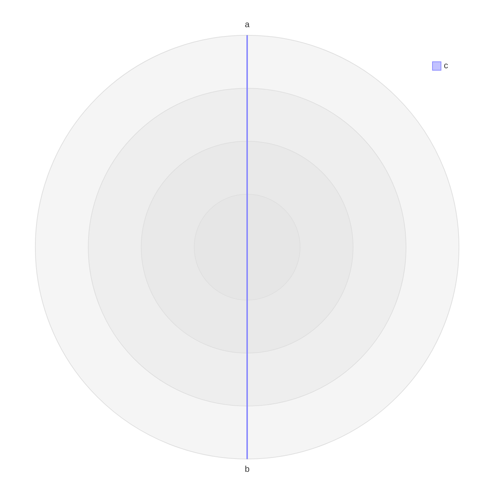

# Task 518 — Dependency and vendored runtime security upgrades

> **Status:** ✅ DONE (2026-08-29).
> **Impact:** 🔴 security remediation + dependency maintenance.
> **Atomicity:** all phases, verification, tracker closure, and the single final implementation commit complete together; no partial handoff or early closure.
> **Origin:** user-approved dependency, security, and `media-src/vendor/` audit; supersedes the plan formerly stored at `docs/superpowers/plans/2026-08-28-dependency-vendor-security-upgrades.md`.

**Goal:** Complete the full dependency and vendored-runtime security upgrade program as one atomic task that cannot be partially closed or handed off.

**Architecture:** Treat npm workspaces and shipped vendored artifacts as separate dependency domains inside one task. Internal phases preserve safe sequencing and focused verification, but they are not independent deliverables: all security remediations, audit tooling, direct dependency upgrades, renderer/vendor upgrades, Vditor/Lute trials, decisions, full gates, tracker closure, and the single final implementation commit must succeed before any completion claim or handoff.

**Tech Stack:** npm lockfiles, Node ESM, TypeScript, Vitest, Playwright Chromium, `vscode-test-playwright`, esbuild, OSV query API, SHA-256-pinned browser bundles, Go/TinyGo WASM, Vditor, Lute.

**Spec:** `tasks/done/481-dependency-audit-triage.md`, refreshed by the approved 2026-08-28 root/webview/e2e/vendor audit; command authority is `DEVELOPMENT.md`, and Vditor-specific procedure is `docs/vditor-patch-checklist.md`.

## 1. Global constraints.

- Use npm for repository dependency installation. A Markmap rebuild may use upstream's own pinned pnpm workspace only inside a temporary directory; it must not add a pnpm lockfile, `packageManager` field, or pnpm dependency to this repository.
- Keep `package-lock.json`, `media-src/package-lock.json`, and `test/vscode-e2e/package-lock.json` isolated. Never flatten the three workspaces.
- Never run `npm audit fix --force`; stop when a proposed fix crosses an unapproved major or engine floor.
- Preserve `engines.node: ">=22"` and `engines.vscode: "^1.110.0"` unless the Project Owner separately approves raising a compatibility floor.
- Keep `@types/node` on major 22. Pin `@types/vscode` to the supported VS Code 1.110 API surface instead of allowing its caret range to expose APIs newer than the declared engine floor.
- Every shipped vendor file must have immutable provenance, SHA-256 metadata, and shipped license/notice coverage through `media-src/vendor/vendored-assets.mjs`.
- Build with `node build.mjs` before every Chromium or real-VS-Code renderer check. Run browser and VS Code tests under `xvfb-run -a`; prefix real-VS-Code commands with `env -u ELECTRON_RUN_AS_NODE`.
- Any renderer/vendor behavior change needs unit coverage, Chromium coverage, and a written and run focused real-VS-Code spec. Chromium evidence does not substitute for the real webview.
- Lute changes must prove byte-stable Markdown round trips in IR and WYSIWYG, raw-text stability in SV, incremental/full serializer agreement, and host-prerender compatibility.
- Preserve all unrelated working-tree changes. `LOCAL_AGENT_TASK.md` stays untracked, unstaged, uncommitted, and unchanged.
- Do not create intermediate implementation commits. Keep phase checkpoints as verified working-tree diffs; create exactly one focused local commit only after every phase and final gate is complete.
- A phase may be described as internally verified, but never as delivered, done, closed, or ready for handoff while any later phase remains incomplete.
- A rejected upgrade is terminal only when the same atomic task records current evidence for retaining the old version and an explicit revisit trigger; it may not be moved to a follow-on task.
- Never push, modify remotes, merge branches, or rewrite history.
- Version targets are the verified 2026-08-28 snapshot. Re-run `npm outdated`, npm audits, and vendor OSV queries before each batch; accept a newer patch only when it stays within the batch's declared compatibility boundary and the task file records the new evidence.

## 2. Approved version boundaries.

| Domain | Current | Approved target/boundary |
|---|---:|---:|
| Mermaid vendor | 11.15.0 | 11.17.2 |
| KaTeX Vditor asset | 0.16.9 | 0.16.47; stay on 0.16.x |
| Markmap bundle | markmap 0.18.12 + vulnerable linkify-it | markmap 0.18.12 rebuilt with markdown-it 14.3.0 and linkify-it 5.0.2 |
| Vditor | 3.11.2 | 3.11.3 isolated trial |
| Dagre | 3.0.0 | 3.1.1 isolated layout batch |
| Playwright webview | 1.60.0 | 1.62.1, matching the e2e harness |
| TypeScript | 7.0.2 | retain |
| jsdom | 29.1.1 | retain until its Node floor is compatible |
| D2 compiler | 0.1.33 | retain; npm release is current |

---

## 3. Atomic implementation and verification checklist.

> **Atomic completion rule:** Every phase below is mandatory. Do not create follow-on implementation plans, split task 518, update `tasks/README.md` early, or hand off a subset. Maintain one active task file and one cumulative working tree until the final verification and single final commit.

### 3.1. Phase 1 — Capture the immutable baseline.

**Files:**
- Modify: `tasks/518-dependency-vendor-security-upgrades.md`
- Modify at final closure only: `tasks/README.md`

**Interfaces:**
- Produces: one status authority containing the exact before/after advisory counts, target versions, per-batch commits, verification commands, retries, and residual risks.
- Consumes: this task file and the current commands in `DEVELOPMENT.md`.

- [x] **Step 1: Mark this task in progress and initialize its evidence ledger before touching dependency or vendor bytes**

Change the header status to `🔄 IN PROGRESS`, add the execution start date, and record the three confirmed vendor findings separately from the clean npm-tree result under `## 4. Execution evidence.`:

```markdown
### 4.1. Baseline.

- npm root, media-src, and vscode-e2e audits: 0 known vulnerabilities on 2026-08-28.
- vendored Mermaid 11.15.0: affected by five advisories, four document-reachable.
- Vditor-supplied KaTeX 0.16.9: five advisories, including two document-reachable DoS paths.
- vendored Markmap 0.18.12: embeds linkify-it affected by two quadratic-complexity DoS advisories.
- 33/33 recorded vendor hashes match; 20/20 vendor registry entries have live consumers.
```

- [x] **Step 2: Re-run the three npm advisory gates and save exact totals in the task**

Run:

```bash
npm run audit
npm run audit:vscode-e2e
npm audit signatures
npm --prefix media-src audit signatures
npm --prefix test/vscode-e2e audit signatures
```

Expected: all commands exit 0; each npm audit reports 0 vulnerabilities. Record signature and attestation counts without describing unattested packages as compromised.

- [x] **Step 3: Re-run freshness and vendor integrity baselines**

Run:

```bash
npm outdated --json
npm --prefix media-src outdated --json
npm --prefix test/vscode-e2e outdated --json
node scripts/check-vendored-usage.mjs
npx vitest run --config test/vitest.config.ts test/backend/vendored-licenses.test.ts test/backend/mermaid-pin.test.ts test/backend/echarts-pin.test.ts test/backend/custom-diagrams-pin.test.ts test/backend/lute-pin.test.ts
```

Expected: `outdated` exits 1 with JSON while updates exist; vendor usage reports 20/20 live; focused pin/license tests pass.

- [x] **Step 4: Validate the task-authority checkpoint without committing**

```bash
git diff --check -- tasks/518-dependency-vendor-security-upgrades.md
git status --short
```

Expected: the task file is present and valid, nothing is staged, and `LOCAL_AGENT_TASK.md` remains untracked.

### 3.2. Phase 2 — Upgrade the shipped Mermaid bundle to 11.17.2.

**Files:**
- Create: `.gitattributes`
- Modify: `media-src/vendor/mermaid/mermaid.min.js`
- Modify: `media-src/vendor/mermaid/source.json`
- Modify: `media-src/vendor/mermaid/NOTICE`
- Modify if upstream text changed: `media-src/vendor/mermaid/LICENSE`
- Modify: `test/backend/mermaid-pin.test.ts`
- Modify: `media-src/src/diagrams/mermaid/mermaid-c4-colors.ts`
- Modify: `media-src/src/diagrams/mermaid/mermaid-c4-colors.test.ts`
- Modify: `media-src/e2e/mermaid-palette.spec.ts`
- Create: `test/vscode-e2e/fixtures/mermaid-security.md`
- Create: `test/vscode-e2e/mermaid-security.spec.ts`
- Modify: `test/vscode-e2e/mermaid-c4-colors.spec.ts`
- Modify: `tasks/518-dependency-vendor-security-upgrades.md`

**Interfaces:**
- Consumes: `media-src/scripts/fetch-mermaid.mjs <version>` and `patchMermaidVersion(code, version)` from `media-src/esbuild-shared.mjs`.
- Produces: SHA-pinned Mermaid 11.17.2 copied to `media/vditor/dist/js/mermaid/mermaid.min.js`; the Vditor loader cache-buster is derived from `source.json.version`.

- [x] **Step 1: Make the pin test fail on the vulnerable version**

Add to `test/backend/mermaid-pin.test.ts`:

```ts
it('pins the advisory-clean Mermaid release approved by task 518', () => {
  expect(source.version).toBe('11.17.2')
})
```

- [x] **Step 2: Run the pin and Vditor patch tests RED**

Run:

```bash
npx vitest run --config test/vitest.config.ts test/backend/mermaid-pin.test.ts test/backend/vditor-source-patches.test.ts
```

Expected: the new assertion fails with received version `11.15.0`; existing Vditor patch tests remain green.

- [x] **Step 3: Re-pin through the repository fetcher**

Run:

```bash
node media-src/scripts/fetch-mermaid.mjs 11.17.2
```

Inspect `source.json`, `NOTICE`, license text, and `git diff --stat`. Do not edit the generated minified bundle manually.

- [x] **Step 4: Add a focused real-VS-Code fixture for affected diagram families**

Create `test/vscode-e2e/fixtures/mermaid-security.md` with bounded, valid architecture, XY, and radar diagrams:

````markdown
```mermaid
architecture-beta
  group mermaidPrototypePollutionMarker(cloud)[Marker]
  service a(server)[A] in __proto__
  service b(server)[B] in mermaidPrototypePollutionMarker
  a:R -- L:b
```

```mermaid
xychart-beta
  x-axis [1, 2, 3]
  line [1, 2, 3]
```


````

- [x] **Step 5: Write the real-webview security-family smoke**

In `test/vscode-e2e/mermaid-security.spec.ts`, open the fixture through `vscode.openWith`, wait for three `.language-mermaid svg` nodes, and assert no themed error box. Add a prototype-pollution guard around the architecture render:

```ts
const state = await frame.locator('body').evaluate(() => ({
  rendered: document.querySelectorAll('.language-mermaid svg').length,
  errors: document.querySelectorAll('.language-mermaid .vmarkd-diagram-error').length,
  polluted: Object.prototype.hasOwnProperty.call(
    Object.prototype,
    'mermaidPrototypePollutionMarker',
  ),
}))
expect(state).toEqual({ rendered: 3, errors: 0, polluted: false })
```

- [x] **Step 6: Run focused GREEN gates**

Run:

```bash
npx vitest run --config test/vitest.config.ts test/backend/mermaid-pin.test.ts test/backend/vditor-source-patches.test.ts test/backend/vendored-licenses.test.ts
node build.mjs
xvfb-run -a npm --prefix media-src run test:e2e -- --grep mermaid
env -u ELECTRON_RUN_AS_NODE xvfb-run -a npm --prefix test/vscode-e2e test -- mermaid-security.spec.ts mermaid-error.spec.ts mermaid-c4-colors.spec.ts mermaid-style-scope.spec.ts
```

Expected: every command exits 0; no retry recovery is reported as a clean first-pass result.

- [x] **Step 7: Record the Mermaid checkpoint without committing**

```bash
git diff --check -- media-src/vendor/mermaid test/backend/mermaid-pin.test.ts test/vscode-e2e/fixtures/mermaid-security.md test/vscode-e2e/mermaid-security.spec.ts tasks/518-dependency-vendor-security-upgrades.md
git status --short
```

Record exact GREEN commands in task 518 and continue with the same uncommitted working tree.

### 3.3. Phase 3 — Make KaTeX an explicit 0.16.47 vendor tree.

**Files:**
- Modify: `media-src/.gitignore`
- Create: `media-src/scripts/fetch-katex.mjs`
- Modify: `media-src/vendor/katex/source.json`
- Create: `media-src/vendor/katex/NOTICE`
- Replace with upstream 0.16.47 text if changed: `media-src/vendor/katex/LICENSE`
- Create under `media-src/vendor/katex/dist/`: `katex.min.js`, `katex.min.css`, `contrib/mhchem.min.js`, and `fonts/*`
- Modify: `media-src/vendor/vendored-assets.mjs`
- Modify: `build.mjs`
- Modify: `media-src/esbuild-shared.mjs`
- Create: `test/backend/katex-pin.test.ts`
- Modify: `test/backend/vendored-licenses.test.ts`
- Modify: `test/backend/vditor-source-patches.test.ts`
- Create: `test/vscode-e2e/fixtures/katex-security.md`
- Create: `test/vscode-e2e/katex-security.spec.ts`
- Modify: `tasks/518-dependency-vendor-security-upgrades.md`

**Interfaces:**
- Extends `VENDORED_ASSETS` entries with optional `copyTree: Array<[sourceDir: string, destinationDir: string]>`.
- Produces `patchKatexVersion(code: string, version: string): string`, chained with `patchMathRender` for `vditor/src/ts/markdown/mathRender.ts`.
- Produces `source.json.components = [{ecosystem:'npm', name:'katex', version:'0.16.47'}]` for Task 5.

- [x] **Step 1: Add failing registry and pin tests**

In `test/backend/katex-pin.test.ts`, assert:

```ts
expect(source.version).toBe('0.16.47')
expect(source.components).toEqual([
  { ecosystem: 'npm', name: 'katex', version: '0.16.47' },
])
expect(Object.keys(source.files)).toEqual(
  expect.arrayContaining([
    'dist/katex.min.js',
    'dist/katex.min.css',
    'dist/contrib/mhchem.min.js',
  ]),
)
```

Extend `vendored-licenses.test.ts` so every `copyTree` source directory exists and every regular file beneath it has a `source.json.files` SHA entry.

- [x] **Step 2: Run focused tests RED**

Run:

```bash
npx vitest run --config test/vitest.config.ts test/backend/katex-pin.test.ts test/backend/vendored-licenses.test.ts
```

Expected: failure because the current KaTeX directory is license-only and `copyTree` is unsupported.

- [x] **Step 3: Implement deterministic KaTeX fetching**

`fetch-katex.mjs` must `npm pack katex@0.16.47` into `fs.mkdtemp`, extract only the browser runtime files, hash each output, copy upstream license text, and write:

```json
{
  "package": "katex",
  "version": "0.16.47",
  "license": "MIT",
  "fetchedFrom": "npm pack katex@0.16.47",
  "components": [
    { "ecosystem": "npm", "name": "katex", "version": "0.16.47" }
  ],
  "files": {}
}
```

Populate `files` with normalized forward-slash paths and `{ "sha256": "..." }` values. Reject an archive whose `package.json.version` is not exactly `0.16.47`.

- [x] **Step 4: Extend vendor syncing for one recursive tree**

Add `copyTree: [['dist', '']]` to the KaTeX entry. In `syncVendored`, recursively copy files from the declared source tree after each source file's recorded hash has been verified; reject symlinks and reject any copied file missing from `source.json.files`.

- [x] **Step 5: Add the cache-buster patch**

Implement an anchor-asserted replacement over all three KaTeX URLs:

```js
export function patchKatexVersion(code, version) {
  const matches = code.match(/dist\/js\/katex\/(?:katex\.min\.(?:css|js)|mhchem\.min\.js)\?v=0\.16\.9/g) ?? []
  if (matches.length !== 3) {
    throw new Error('patchKatexVersion: expected three KaTeX 0.16.9 URLs (version drift?)')
  }
  return code.replace(/(dist\/js\/katex\/(?:katex\.min\.(?:css|js)|mhchem\.min\.js)\?v=)0\.16\.9/g, `$1${version}`)
}
```

Chain `patchKatexVersion(patchMathRender(code), katexPin.version)` in the existing math-render registry entry and test all three rewritten URLs against the real vendored Vditor source.

- [x] **Step 6: Fetch and verify the new vendor tree**

Run:

```bash
node media-src/scripts/fetch-katex.mjs 0.16.47
npx vitest run --config test/vitest.config.ts test/backend/katex-pin.test.ts test/backend/vendored-licenses.test.ts test/backend/vditor-source-patches.test.ts
```

Expected: hashes, license metadata, tree coverage, and cache-busters pass.

- [x] **Step 7: Add real-webview math coverage**

The fixture must contain inline math, display math, `mhchem`, a macro, malformed input, and literal `\\edef` text that is rejected/rendered without blocking. The spec must assert rendered `.katex` nodes, one themed error for malformed input, and a responsive page using an `expect.poll` heartbeat after all blocks settle.

- [x] **Step 8: Run focused renderer verification**

Run:

```bash
node build.mjs
npx vitest run --config test/vitest.config.ts test/backend/katex-pin.test.ts test/backend/vditor-source-patches.test.ts test/backend/assets.test.ts
xvfb-run -a npm --prefix media-src run test:e2e -- --grep 'math|KaTeX'
env -u ELECTRON_RUN_AS_NODE xvfb-run -a npm --prefix test/vscode-e2e test -- katex-security.spec.ts parity.spec.ts mode-switch-parity.spec.ts
npm run check:bundle-size
```

- [x] **Step 9: Record the KaTeX checkpoint without committing**

```bash
git diff --check -- media-src/scripts/fetch-katex.mjs media-src/vendor/katex media-src/vendor/vendored-assets.mjs build.mjs media-src/esbuild-shared.mjs test/backend/katex-pin.test.ts test/backend/vendored-licenses.test.ts test/backend/vditor-source-patches.test.ts test/vscode-e2e/fixtures/katex-security.md test/vscode-e2e/katex-security.spec.ts tasks/518-dependency-vendor-security-upgrades.md
git status --short
```

Record exact GREEN commands in task 518 and continue without committing.

### 3.4. Phase 4 — Rebuild Markmap 0.18.12 with fixed linkification.

**Files:**
- Modify: `media-src/scripts/fetch-markmap.mjs`
- Modify: `media-src/vendor/markmap/markmap.min.js`
- Modify: `media-src/vendor/markmap/source.json`
- Modify if generated attribution changes: `media-src/vendor/markmap/LICENSE`
- Modify: `test/backend/custom-diagrams-pin.test.ts`
- Create: `test/backend/markmap-security.test.ts`
- Modify: `media-src/e2e/harness-entries.mjs`
- Create: `media-src/e2e/markmap-security-harness.ts`
- Create: `media-src/e2e/markmap-security.html`
- Create: `media-src/e2e/markmap-security.spec.ts`
- Create: `test/vscode-e2e/fixtures/markmap-security.md`
- Create: `test/vscode-e2e/markmap-security.spec.ts`
- Modify: `tasks/518-dependency-vendor-security-upgrades.md`

**Interfaces:**
- Consumes immutable Markmap commit `205367a24603dc187f67da1658940c6cade20dce` for release 0.18.12.
- Uses an upstream-only temporary pnpm workspace with overrides `markdown-it: 14.3.0` and `linkify-it: 5.0.2`.
- Produces `source.json.components` entries for `markmap-lib`, `markmap-view`, `markdown-it`, `linkify-it`, and `d3`.

- [x] **Step 1: Add failing provenance and vulnerable-signature tests**

In `test/backend/markmap-security.test.ts`:

```ts
expect(source.build.sourceCommit).toBe(
  '205367a24603dc187f67da1658940c6cade20dce',
)
expect(source.components).toContainEqual({
  ecosystem: 'npm',
  name: 'linkify-it',
  version: '5.0.2',
})
expect(js).not.toContain(
  `re.src_email_name = '[\\\\-;:&=\\\\+\\\\$,\\\\.a-zA-Z0-9_][\\\\-;:&=\\\\+\\\\$,\\\\"\\\\.a-zA-Z0-9_]*'`,
)
```

- [x] **Step 2: Run security tests RED**

Run:

```bash
npx vitest run --config test/vitest.config.ts test/backend/markmap-security.test.ts test/backend/custom-diagrams-pin.test.ts
```

Expected: failure because current metadata lacks nested components and the bundle contains the affected unbounded email regex.

- [x] **Step 3: Replace prebuilt-download mode with a reproducible source rebuild**

Update `fetch-markmap.mjs` to:

1. create a temporary directory;
2. download/extract the GitHub archive at commit `205367a24603dc187f67da1658940c6cade20dce`;
3. patch only the temporary workspace root with pnpm overrides for `markdown-it@14.3.0` and `linkify-it@5.0.2`;
4. run `corepack pnpm install --frozen-lockfile=false` and `corepack pnpm --filter markmap-lib build:js` in that temporary checkout;
5. assert the resolved versions with `corepack pnpm --filter markmap-lib list markdown-it linkify-it --depth 4 --json`;
6. combine the rebuilt `packages/markmap-lib/dist/browser/index.iife.js`, the release-matched `markmap-view` browser build, and the repository's d3 subset;
7. write the combined hash, source commit, build command, and nested component versions to `source.json`.

Do not write upstream lockfiles or workspace manifests into this repository.

- [x] **Step 4: Add bounded algorithmic regression probes**

Load the vendored bundle in jsdom, instantiate `window.markmap.Transformer`, warm it once, and measure 4,000 versus 8,000 repeated email-like tokens in fresh child processes. Assert the 8,000 case completes under 1,000 ms and less than 3.5 times the 4,000 duration; give each child a 5-second process timeout so a regression fails without wedging Vitest.

- [x] **Step 5: Rebuild and run focused unit GREEN**

Run:

```bash
node media-src/scripts/fetch-markmap.mjs 0.18.12 --write
npx vitest run --config test/vitest.config.ts test/backend/markmap-security.test.ts test/backend/custom-diagrams-pin.test.ts test/backend/vditor-source-patches.test.ts
```

- [x] **Step 6: Add a real-webview Markmap security fixture**

Include ordinary headings plus bounded repeated email-like and `mailto:` text. Assert an SVG renders, the page remains responsive, no remote request occurs, zoom gating still works, and `Object.prototype` is unchanged.

- [x] **Step 7: Run focused Markmap verification**

Run:

```bash
node build.mjs
xvfb-run -a npm --prefix media-src run test:e2e -- --grep markmap
env -u ELECTRON_RUN_AS_NODE xvfb-run -a npm --prefix test/vscode-e2e test -- markmap-security.spec.ts markmap-resize.spec.ts diagram-render-sweep.spec.ts
npm run check:bundle-size
```

- [x] **Step 8: Record the Markmap checkpoint without committing**

```bash
git diff --check -- media-src/scripts/fetch-markmap.mjs media-src/vendor/markmap test/backend/custom-diagrams-pin.test.ts test/backend/markmap-security.test.ts test/vscode-e2e/fixtures/markmap-security.md test/vscode-e2e/markmap-security.spec.ts tasks/518-dependency-vendor-security-upgrades.md
git status --short
```

Record exact GREEN commands in task 518 and continue without committing.

### 3.5. Phase 5 — Add exact-version vendor advisory auditing.

**Files:**
- Create: `scripts/audit-vendored.mjs`
- Create: `scripts/audit-d2-go.mjs`
- Create: `test/backend/audit-vendored.test.ts`
- Create: `test/backend/audit-d2-go.test.ts`
- Modify: every executable `media-src/vendor/*/source.json`
- Modify: `package.json`
- Modify: `scripts/quality.mjs`
- Modify: `.github/workflows/ci.yml`
- Modify: `.github/workflows/pr-webview-smoke.yml`
- Modify: `.github/workflows/nightly.yml`
- Modify: `.github/workflows/publish.yml`
- Modify: `DEVELOPMENT.md`
- Modify: `tasks/518-dependency-vendor-security-upgrades.md`

**Interfaces:**
- Consumes optional `source.json.components: Array<{ecosystem:'npm'|'Go'|'Maven', name:string, version:string}>`.
- Consumes required fallback `source.json.advisoryAudit: {kind:'unscannable', reason:string, reviewedAt:string}` for artifacts that cannot be mapped to a package version.
- Produces `collectVendorComponents(root)`, `queryOsv(components, fetchImpl)`, and CLI exit 1 when an exact pinned version has a current OSV finding.
- Produces a D2 Go audit that blob-filters commit `2446e24` into a temporary directory, applies the same three stubs and compile-only entrypoint as `build-d2-wasm.sh`, installs govulncheck as a host tool with the build script's pinned Go version, and runs that tool with `GOOS=js GOARCH=wasm` against `./d2compileonly` without changing repository dependencies.

- [x] **Step 1: Write parser and response tests RED**

Cover exact component collection, composite bundles, malformed metadata, declared unscannable artifacts, OSV batching, network errors, and non-empty vulnerability results. The network layer must be injectable:

```js
export async function queryOsv(components, fetchImpl = fetch) {
  const response = await fetchImpl('https://api.osv.dev/v1/querybatch', {
    method: 'POST',
    headers: { 'content-type': 'application/json' },
    body: JSON.stringify({
      queries: components.map(({ ecosystem, name, version }) => ({
        package: { ecosystem, name },
        version,
      })),
    }),
  })
  if (!response.ok) throw new Error(`OSV query failed: ${response.status}`)
  return response.json()
}
```

- [x] **Step 2: Run audit-tool tests RED**

Run:

```bash
npx vitest run --config test/vitest.config.ts test/backend/audit-vendored.test.ts
```

Expected: failure because the script and exports do not exist.

- [x] **Step 3: Implement strict metadata collection**

Fail when an executable vendor entry has neither at least one exact component nor an explicit unscannable decision. De-duplicate identical ecosystem/name/version triples while retaining all source directories for reporting.

- [x] **Step 4: Populate every vendor metadata decision**

Use exact package coordinates for npm-origin bundles, `oss.terrastruct.com/d2@v0.1.33` for D2, and `net.sourceforge.plantuml:plantuml@1.2026.6` for PlantUML. Mark content-only stdlib packs as unscannable with their per-library tags/SHAs; mark Lute's commit pin and the current Viz version gap explicitly rather than claiming they are clean.

- [x] **Step 5: Implement and test the D2 transitive Go audit**

`audit-d2-go.mjs` must read `D2_COMMIT` from `build-d2-wasm.sh`, reject a dirty or mismatched checkout, work only in `fs.mkdtemp`, copy the existing stub/entrypoint files, and surface `govulncheck` output and exit code unchanged. Unit tests must inject a fake command runner and assert the exact clone, checkout, copy, and audit sequence without network access.

- [x] **Step 6: Wire the audit only after the baseline is green**

Add:

```json
"audit:vendor": "node scripts/audit-vendored.mjs",
"audit:d2-go": "node scripts/audit-d2-go.mjs",
"audit": "npm run audit:host && npm run audit:webview && npm run audit:vendor"
```

Keep `audit:vscode-e2e` and the slower toolchain-downloading `audit:d2-go` separate. Add the OSV vendor audit to `scripts/quality.mjs` through the existing root `audit` stage. Run `audit:d2-go` in nightly and release workflows, and document that the OSV script checks declared exact versions while the D2 script checks the compile-only Go call graph.

- [x] **Step 7: Run tool and repository gates GREEN**

Run:

```bash
npx vitest run --config test/vitest.config.ts test/backend/audit-vendored.test.ts test/backend/audit-d2-go.test.ts test/backend/vendored-licenses.test.ts
npm run audit:vendor
npm run audit:d2-go
npm run audit
npm run lint:ci
```

- [x] **Step 8: Record the vendor-audit checkpoint without committing**

```bash
git diff --check -- scripts/audit-vendored.mjs scripts/audit-d2-go.mjs test/backend/audit-vendored.test.ts test/backend/audit-d2-go.test.ts media-src/vendor package.json scripts/quality.mjs .github/workflows DEVELOPMENT.md tasks/518-dependency-vendor-security-upgrades.md
git status --short
```

Record exact GREEN commands in task 518 and continue without committing.

### 3.6. Phase 6 — Refresh compatible root development tooling.

**Files:**
- Modify: `package.json`
- Modify: `package-lock.json`
- Modify if diagnostics legitimately change: `biome.json`
- Modify: `tasks/518-dependency-vendor-security-upgrades.md`

**Interfaces:**
- Upgrades within approved lines: Biome 2.5.11, Vitest/coverage 4.1.11, dependency-cruiser 18.2.0, jscpd 5.0.16, knip 6.32.3, `@types/node` 22.20.1.
- Pins `@types/vscode` to `1.110.0` while retaining `engines.vscode: ^1.110.0`.
- Leaves TypeScript 7.0.2, jsdom 29.1.1, and oxc-parser 0.140.0 unchanged in this batch.

- [x] **Step 1: Capture the pre-update gate baseline**

Run:

```bash
npm run lint:ci
npm test
npm run typecheck
npm run typecheck:strict
npm run knip
npm run depcruise
```

Record any pre-existing failure before changing the lockfile.

- [x] **Step 2: Install exact approved versions**

Run:

```bash
npm install --save-dev @biomejs/biome@^2.5.11 @types/node@^22.20.1 @vitest/coverage-v8@^4.1.11 dependency-cruiser@^18.2.0 jscpd@^5.0.16 knip@^6.32.3 vitest@^4.1.11
npm install --save-dev --save-exact @types/vscode@1.110.0
```

Expected: the first command preserves caret ranges and the second writes exactly `"@types/vscode": "1.110.0"`.

- [x] **Step 3: Inspect dependency and diagnostic drift**

Run:

```bash
npm ls --depth=0
npm dedupe --dry-run
git diff -- package.json package-lock.json biome.json
```

Do not accept formatter-wide rewrites or new lint suppressions merely to make an upgrade green.

- [x] **Step 4: Run complete root-tooling verification**

Run:

```bash
npm run audit
npm run lint:ci
npm run knip
npm run jscpd
npm run depcruise
npm run typecheck
npm run typecheck:strict
npm run typecheck:vscode-e2e
npm run test:coverage
npm run check:coverage-modules
npm run quality
```

- [x] **Step 5: Record the root-tooling checkpoint without committing**

```bash
git diff --check -- package.json package-lock.json biome.json tasks/518-dependency-vendor-security-upgrades.md
git status --short
```

Continue without committing.

### 3.7. Phase 7 — Align webview Playwright and compatible build tooling.

**Files:**
- Modify: `media-src/package.json`
- Modify: `media-src/package-lock.json`
- Modify only if browser output intentionally changes: `media-src/e2e/*-snapshots/*`
- Modify: `tasks/518-dependency-vendor-security-upgrades.md`

**Interfaces:**
- Upgrades `@playwright/test` 1.60.0→1.62.1, `@playwright/cli` 0.1.14→0.1.18, esbuild to 0.28.2, Monocart to 2.13.0, and `@types/node` within major 22.
- Leaves runtime dependencies, Three.js, and Vega untouched.

- [x] **Step 1: Update only the declared build/test tools**

Run:

```bash
npm --prefix media-src install --save-dev @playwright/test@^1.62.1 @playwright/cli@^0.1.18 esbuild@^0.28.2 monocart-coverage-reports@^2.13.0 @types/node@^22.20.1
git diff -- media-src/package.json media-src/package-lock.json
```

Expected: runtime dependencies, Three.js, Vega, D3, and Vditor remain unchanged.

- [x] **Step 2: Verify Vditor source patches and emitted budgets before browser tests**

Run:

```bash
npx vitest run --config test/vitest.config.ts test/backend/vditor-source-patches.test.ts test/backend/patch-mutation.test.ts
node build.mjs
npm run check:bundle-size
npm run check:startup-cost
npm run typecheck
```

- [x] **Step 3: Run Chromium and real-VS-Code harness gates**

Run:

```bash
xvfb-run -a npm --prefix media-src run test:e2e
npm run typecheck:vscode-e2e
npm run audit:vscode-e2e
env -u ELECTRON_RUN_AS_NODE xvfb-run -a npm run test:vscode:smoke
env -u ELECTRON_RUN_AS_NODE xvfb-run -a npm run test:vscode:fast
```

Record retries separately. Do not refresh visual goldens unless a viewed diff proves an intentional renderer change.

- [x] **Step 4: Record the webview-tooling checkpoint without committing**

```bash
git diff --check -- media-src/package.json media-src/package-lock.json tasks/518-dependency-vendor-security-upgrades.md
git status --short
```

Continue without committing.

### 3.8. Phase 8 — Upgrade Dagre without mixing other renderer changes.

**Files:**
- Modify: `media-src/package.json`
- Modify: `media-src/package-lock.json`
- Modify: `media-src/vendor/d2/LICENSE-dagre`
- Modify only when types require it: `media-src/src/diagrams/d2/d2-layout.ts`
- Create: `media-src/src/diagrams/d2/dagre-3.1-compat.test.ts`
- Create: `test/vscode-e2e/fixtures/dagre-3.1-compat.md`
- Create: `test/vscode-e2e/dagre-3.1-compat.spec.ts`
- Modify: `tasks/518-dependency-vendor-security-upgrades.md`

**Interfaces:**
- Upgrades `@dagrejs/dagre` 3.0.0→3.1.1.
- Preserves the existing D2 layout adapter contract and ELK fallback behavior.

- [x] **Step 1: Add a fixture that locks current compound-container and cross-cluster geometry**

Write the unit expectation against semantic layout invariants: every node has finite coordinates, container edges terminate on container bounds, and sibling order is stable. Do not pin the entire SVG byte-for-byte.

- [x] **Step 2: Run the focused test against 3.0.0 GREEN, then update to 3.1.1**

Run:

```bash
npx vitest run --config test/vitest.config.ts media-src/src/diagrams/d2/dagre-3.1-compat.test.ts
npm --prefix media-src install @dagrejs/dagre@^3.1.1
```

The pre-update GREEN result establishes the compatibility contract before dependency movement.

- [x] **Step 3: Run D2 verification**

Run:

```bash
npx vitest run --config test/vitest.config.ts media-src/src/diagrams/d2
node build.mjs
npm run check:bundle-size
xvfb-run -a npm --prefix media-src run test:e2e -- --grep D2
env -u ELECTRON_RUN_AS_NODE xvfb-run -a npm --prefix test/vscode-e2e test -- dagre-3.1-compat.spec.ts d2-lazy-load.spec.ts d2-render-sweep.spec.ts d2-sketch.spec.ts
```

- [x] **Step 4: Record the Dagre checkpoint without committing**

```bash
git diff --check -- media-src/package.json media-src/package-lock.json media-src/vendor/d2/LICENSE-dagre media-src/src/diagrams/d2/d2-layout.ts media-src/src/diagrams/d2/dagre-3.1-compat.test.ts test/vscode-e2e/fixtures/dagre-3.1-compat.md test/vscode-e2e/dagre-3.1-compat.spec.ts tasks/518-dependency-vendor-security-upgrades.md
git status --short
```

Continue without committing.

### 3.9. Phase 9 — Trial Vditor 3.11.3 through the complete patch checklist.

**Files:**
- Modify: `media-src/package.json`
- Modify: `media-src/package-lock.json`
- Modify only on proven drift: `media-src/esbuild-shared.mjs`
- Modify only on proven drift: `build.mjs`
- Modify only on proven drift: `docs/vditor-patch-checklist.md`
- Create: `test/backend/vditor-3.11.3-compat.test.ts`
- Create: `test/vscode-e2e/fixtures/vditor-3.11.3-compat.md`
- Create: `test/vscode-e2e/vditor-3.11.3-compat.spec.ts`
- Modify: `tasks/518-dependency-vendor-security-upgrades.md`

**Interfaces:**
- Upgrades Vditor 3.11.2→3.11.3 while continuing to override Mermaid, KaTeX, Lute, ECharts, Markmap, and other registered assets with this repository's pins.
- Preserves all 34 `VDITOR_TS_PATCHES` registry entries and every anchored CSS patch unless upstream behavior proves a patch obsolete.

- [x] **Step 1: Record upstream source and asset differences**

Use `npm diff --diff=vditor@3.11.2 --diff=vditor@3.11.3` and the exact Git commits `2d6f483330c0345e3ef5cfbb1b377c4abd0ccc08..242fa3ee26508be041fa1a4436d1eb1f29fba31d`. Classify editor logic, copied assets, CSS, and types separately in task 518.

- [x] **Step 2: Install Vditor 3.11.3 and run fail-loud patch gates first**

Run:

```bash
npm --prefix media-src install vditor@^3.11.3
npx vitest run --config test/vitest.config.ts test/backend/vditor-source-patches.test.ts test/backend/patch-mutation.test.ts
node build.mjs
```

Expected: all 34 registry entries match and mutate; every CSS anchor also succeeds. If an upstream fix overlaps a local patch, prove behavioral equivalence before removing the patch.

- [x] **Step 3: Pin changed upstream behavior in focused compatibility tests**

`vditor-3.11.3-compat.test.ts` must cover the upstream list-exit helper, reference-link render-destination suppression, and new callout WYSIWYG spin widening against real 3.11.3 source anchors. The real spec must edit a nested list, blockquote-in-list, reference link, callout, heading-in-list, image caption, and WaveDrom block, then assert saved Markdown bytes match the expected fixture.

- [x] **Step 4: Run serialization and editor-mode regression gates**

Run:

```bash
npx vitest run --config test/vitest.config.ts test/backend/vditor-3.11.3-compat.test.ts test/backend/lute-pin.test.ts test/backend/lute-host.test.ts test/backend/minimal-diff-writeback.test.ts test/backend/vditor-source-patches.test.ts media-src/src/editing/callouts.test.ts media-src/src/editing/spin-strip.test.ts media-src/src/bridge/edit-sync.test.ts
xvfb-run -a npm --prefix media-src run test:e2e
```

- [x] **Step 5: Run focused real-VS-Code changed-surface specs**

Run `vditor-3.11.3-compat.spec.ts` plus the existing list, callout, paste, undo/cut/copy, mode-roundtrip, WaveDrom, and all-renderer specs recorded with their current filenames in task 518 after `npx playwright test --list` confirms the inventory.

- [x] **Step 6: Run the routine and full real-VS-Code tiers**

Run:

```bash
env -u ELECTRON_RUN_AS_NODE xvfb-run -a npm run test:vscode:fast
env -u ELECTRON_RUN_AS_NODE xvfb-run -a npm run test:vscode
```

Do not close the Vditor batch on the earlier 34-entry dry-run alone; CSS, runtime behavior, and round-trip evidence are required.

- [x] **Step 7: Run the Vditor phase gates and record the checkpoint without committing**

```bash
npm run check:bundle-size
npm run check:startup-cost
npm run typecheck
npm run typecheck:strict
npm run typecheck:vscode-e2e
npm run quality
git diff --check -- media-src/package.json media-src/package-lock.json media-src/esbuild-shared.mjs build.mjs docs/vditor-patch-checklist.md test/backend/vditor-3.11.3-compat.test.ts test/vscode-e2e/fixtures/vditor-3.11.3-compat.md test/vscode-e2e/vditor-3.11.3-compat.spec.ts tasks/518-dependency-vendor-security-upgrades.md
git status --short
```

Continue without committing.

### 3.10. Phase 10 — Upgrade all remaining vendored renderer families.

**Files:**
- Modify: `media-src/package.json`
- Modify: `media-src/package-lock.json`
- Modify: `media-src/vendor/mermaid-layout-elk/`
- Modify: `media-src/vendor/elk/`
- Modify: `media-src/vendor/vega/`
- Modify: `media-src/vendor/threejs/`
- Modify: `media-src/vendor/abcjs/`
- Modify: `media-src/vendor/smiles-drawer/`
- Modify: `media-src/vendor/wavedrom/`
- Modify: `media-src/vendor/flowchart.js/`
- Modify: `media-src/vendor/plantuml/`
- Modify: `media-src/vendor/viz/`
- Create: `media-src/scripts/fetch-elk.mjs`
- Create: `media-src/scripts/fetch-abcjs.mjs`
- Create: `media-src/scripts/fetch-smiles-drawer.mjs`
- Create: `media-src/scripts/fetch-wavedrom.mjs`
- Create: `media-src/scripts/fetch-flowchart.mjs`
- Create: `media-src/scripts/fetch-plantuml.mjs`
- Modify: `media-src/vendor/vendored-assets.mjs`
- Modify: `media-src/esbuild-shared.mjs`
- Modify: `test/backend/custom-diagrams-pin.test.ts`
- Create: `test/backend/remaining-vendor-pins.test.ts`
- Create: `test/vscode-e2e/fixtures/remaining-vendor-upgrades.md`
- Create: `test/vscode-e2e/remaining-vendor-upgrades.spec.ts`
- Modify: `tasks/518-dependency-vendor-security-upgrades.md`

**Interfaces:**
- Upgrades Mermaid ELK adapter 0.2.2→0.2.3 and ELK 0.11.1→0.12.0.
- Upgrades Vega 6.2.0→6.4.0 while retaining Vega Embed 7.1.0 and Vega-Lite 6.4.3, then regenerates `vega-embed.min.js`.
- Upgrades Three.js 0.184.0→0.185.1 and regenerates `three-stl.min.js`.
- Upgrades ABCJS 6.6.3→6.7.0, smiles-drawer 2.3.0→2.4.1, WaveDrom 3.6.1→3.6.2, and flowchart.js 1.14.1→1.18.0.
- Upgrades PlantUML and its coupled Viz artifact 1.2026.6→1.2026.7 from the same `js-plantuml-1.2026.7.zip` release asset.
- Produces `patchFlowchartVersion(code: string, version: string): string` and derives every other Vditor cache-buster from the relevant vendor pin.

- [x] **Step 1: Write failing exact-version assertions for every remaining family**

Create `remaining-vendor-pins.test.ts` with one table:

```ts
it.each([
  ['mermaid-layout-elk', '0.2.3'],
  ['elk', '0.12.0'],
  ['vega', '7.1.0'],
  ['threejs', '0.185.1'],
  ['abcjs', '6.7.0'],
  ['smiles-drawer', '2.4.1'],
  ['wavedrom', '3.6.2'],
  ['flowchart.js', '1.18.0'],
  ['plantuml', '1.2026.7'],
])('%s is pinned to %s', (dir, version) => {
  expect(readSource(dir).version).toBe(version)
})
```

For Vega, additionally assert its description/components retain `vega-embed@7.1.0` and `vega-lite@6.4.3` while recording `vega@6.4.0`. For Viz, assert `source.json.source` names the same PlantUML 1.2026.7 release and records the exact `@viz-js/viz` version extracted from the release bundle.

- [x] **Step 2: Run the complete version table RED**

Run:

```bash
npx vitest run --config test/vitest.config.ts test/backend/remaining-vendor-pins.test.ts test/backend/custom-diagrams-pin.test.ts
```

Expected: each old pin fails with its current version; existing integrity tests remain green.

- [x] **Step 3: Implement deterministic npm-origin fetchers**

Each new fetcher must use `npm pack <package>@<exact-version>` in `fs.mkdtemp`, validate the archive's package name/version, copy only the documented runtime files plus upstream license, write normalized `source.json.files` SHA-256 entries and exact `components`, and refuse symlinks. Exact mappings:

```text
elkjs@0.12.0              -> elk-api.js, elk-worker.min.js
abcjs@6.7.0               -> abcjs_basic.min.js
smiles-drawer@2.4.1       -> smiles-drawer.min.js
wavedrom@3.6.2            -> wavedrom.min.js
flowchart.js@1.18.0       -> flowchart.min.js
```

Update the flowchart vendor registry entry from license-only to copying `flowchart.min.js`, and add an anchor-counted `patchFlowchartVersion` to the existing `flowchartRender.ts` transform.

- [x] **Step 4: Upgrade ELK and the Mermaid adapter**

Run:

```bash
node media-src/scripts/fetch-mermaid-layout-elk.mjs 0.2.3
node media-src/scripts/fetch-elk.mjs 0.12.0
npx vitest run --config test/vitest.config.ts test/backend/remaining-vendor-pins.test.ts test/backend/custom-diagrams-pin.test.ts
node build.mjs
env -u ELECTRON_RUN_AS_NODE xvfb-run -a npm --prefix test/vscode-e2e test -- mermaid-elk.spec.ts d2-elk.spec.ts
```

- [x] **Step 5: Upgrade and regenerate Vega**

Run:

```bash
npm --prefix media-src install --save-dev vega@^6.4.0
node media-src/scripts/fetch-vega.mjs 7.1.0
npx vitest run --config test/vitest.config.ts test/backend/remaining-vendor-pins.test.ts test/backend/custom-diagrams-pin.test.ts
node build.mjs
env -u ELECTRON_RUN_AS_NODE xvfb-run -a npm --prefix test/vscode-e2e test -- vega-theme.spec.ts
```

- [x] **Step 6: Upgrade and regenerate the Three.js STL bundle**

Run:

```bash
npm --prefix media-src install --save-dev three@^0.185.1
node media-src/scripts/fetch-three.mjs 0.185.1
npx vitest run --config test/vitest.config.ts test/backend/remaining-vendor-pins.test.ts test/backend/custom-diagrams-pin.test.ts
node build.mjs
env -u ELECTRON_RUN_AS_NODE xvfb-run -a npm --prefix test/vscode-e2e test -- stl-material.spec.ts
```

- [x] **Step 7: Upgrade ABCJS, smiles-drawer, WaveDrom, and flowchart.js**

Run:

```bash
node media-src/scripts/fetch-abcjs.mjs 6.7.0
node media-src/scripts/fetch-smiles-drawer.mjs 2.4.1
node media-src/scripts/fetch-wavedrom.mjs 3.6.2
node media-src/scripts/fetch-flowchart.mjs 1.18.0
npx vitest run --config test/vitest.config.ts test/backend/remaining-vendor-pins.test.ts test/backend/custom-diagrams-pin.test.ts test/backend/vditor-source-patches.test.ts
node build.mjs
env -u ELECTRON_RUN_AS_NODE xvfb-run -a npm --prefix test/vscode-e2e test -- abc-edit-collapse.spec.ts abc-edit-jump.spec.ts abc-flip-cache-hit.spec.ts smiles-render.spec.ts wavedrom-theme.spec.ts flowchart-theme.spec.ts
```

- [x] **Step 8: Upgrade PlantUML and Viz from one verified release archive**

`fetch-plantuml.mjs` must download `js-plantuml-1.2026.7.zip`, verify the GitHub release asset digest recorded in task 518, extract both `plantuml.js` and `viz-global.js`, prove they came from the same archive, update both source files/hashes/licenses, and record exact nested Viz version metadata.

Run:

```bash
node media-src/scripts/fetch-plantuml.mjs 1.2026.7
npx vitest run --config test/vitest.config.ts test/backend/remaining-vendor-pins.test.ts test/backend/custom-diagrams-pin.test.ts test/backend/vendored-licenses.test.ts
node build.mjs
env -u ELECTRON_RUN_AS_NODE xvfb-run -a npm --prefix test/vscode-e2e test -- plantuml.spec.ts plantuml-render-sweep.spec.ts plantuml-multiblock.spec.ts plantuml-type-support.spec.ts plantuml-stdlib.spec.ts plantuml-stdlib-more.spec.ts
```

- [x] **Step 9: Add one real-webview cross-family fixture**

`remaining-vendor-upgrades.md` must contain one valid block for Mermaid-ELK, D2-ELK, Vega, Vega-Lite, STL, ABC, SMILES, WaveDrom, flowchart, PlantUML, and Graphviz/Viz. `remaining-vendor-upgrades.spec.ts` must assert every block produces its engine-specific SVG/canvas and no `.vmarkd-diagram-error`, remote request, or console error.

- [x] **Step 10: Run the combined remaining-vendor checkpoint without committing**

Run:

```bash
npx vitest run --config test/vitest.config.ts test/backend/remaining-vendor-pins.test.ts test/backend/custom-diagrams-pin.test.ts test/backend/vendored-licenses.test.ts test/backend/vditor-source-patches.test.ts
node build.mjs
npm run check:bundle-size
npm run check:startup-cost
npm run audit:vendor
xvfb-run -a npm --prefix media-src run test:e2e
env -u ELECTRON_RUN_AS_NODE xvfb-run -a npm --prefix test/vscode-e2e test -- remaining-vendor-upgrades.spec.ts
git diff --check -- media-src/package.json media-src/package-lock.json media-src/scripts media-src/vendor media-src/esbuild-shared.mjs test/backend test/vscode-e2e tasks/518-dependency-vendor-security-upgrades.md
git status --short
```

Record every command and retry in task 518, then continue without committing.

### 3.11. Phase 11 — Trial the latest rebuilt Lute commit in isolation.

**Files:**
- Modify: `media-src/vendor/lute/lute.min.js`
- Modify: `media-src/vendor/lute/lute.min.js.map`
- Modify: `media-src/vendor/lute/source.json`
- Modify: `media-src/vendor/lute/NOTICE`
- Modify if upstream changed it: `media-src/vendor/lute/LICENSE`
- Create: `scripts/compare-lute-roundtrip.mjs`
- Create: `test/backend/lute-refresh-compat.test.ts`
- Create: `test/vscode-e2e/fixtures/lute-refresh-compat.md`
- Create: `test/vscode-e2e/lute-refresh-compat.spec.ts`
- Modify only on proven integration drift: `src/lute/lute-host.ts`, `media-src/src/bridge/edit-sync.ts`, or `media-src/esbuild-shared.mjs`
- Modify: `tasks/518-dependency-vendor-security-upgrades.md`

**Interfaces:**
- Consumes the newest commit returned by `node media-src/scripts/fetch-lute.mjs --list` that actually rebuilt `javascript/lute.min.js`.
- Produces one shared runtime blob used by webview editing, Chromium harnesses, and host prerender.

- [x] **Step 1: Capture old/new round-trip results before accepting the pin**

Build a temporary comparison harness that loads both blobs in isolated VM contexts. Run the repository Markdown corpus through `Md2VditorIRDOM→VditorIRDOM2Md` and `Md2VditorDOM→VditorDOM2Md`, classifying byte diffs by file and construct. A change is accepted only when it fixes known data loss or has an explicit, reviewed normalization decision.

- [x] **Step 2: Verify serializer-specific invariants**

Run:

```bash
npx vitest run --config test/vitest.config.ts test/backend/lute-refresh-compat.test.ts test/backend/lute-pin.test.ts test/backend/lute-host.test.ts test/backend/minimal-diff-writeback.test.ts media-src/src/bridge/edit-sync.test.ts media-src/src/editing/spin-strip.test.ts media-src/src/editing/wysiwyg-code-highlight.test.ts media-src/src/editing/callouts.test.ts
```

`lute-refresh-compat.test.ts` must cover `data-render`, whole-list tightness/ordinals, comments, callouts, wiki nodes, soft breaks, and IR/WYSIWYG round-trip bytes.

- [x] **Step 3: Verify all three consumers**

Run:

```bash
node build.mjs
xvfb-run -a npm --prefix media-src run test:e2e
env -u ELECTRON_RUN_AS_NODE xvfb-run -a npm --prefix test/vscode-e2e test -- lute-refresh-compat.spec.ts
env -u ELECTRON_RUN_AS_NODE xvfb-run -a npm run test:vscode:fast
env -u ELECTRON_RUN_AS_NODE xvfb-run -a npm run test:vscode
```

- [x] **Step 4: Run Lute phase gates and record the checkpoint only if drift is resolved**

```bash
npm run audit:vendor
node build.mjs
npm run check:bundle-size
npm run check:startup-cost
npm run typecheck
npm run typecheck:strict
npm run test:coverage
npm run quality
git diff --check -- media-src/vendor/lute scripts/compare-lute-roundtrip.mjs test/backend/lute-refresh-compat.test.ts test/vscode-e2e/fixtures/lute-refresh-compat.md test/vscode-e2e/lute-refresh-compat.spec.ts src/lute/lute-host.ts media-src/src/bridge/edit-sync.ts media-src/esbuild-shared.mjs tasks/518-dependency-vendor-security-upgrades.md
git status --short
```

If fidelity drift remains, task 518 remains open. Resolve the drift or record an evidence-backed retain-current decision in task 518 before proceeding to final closure; neither outcome creates an intermediate commit.

### 3.12. Phase 12 — Resolve major/pre-1 decisions and close task 518.

**Files:**
- Modify only after explicit compatible trials: root or e2e manifests and lockfiles
- Modify: `tasks/518-dependency-vendor-security-upgrades.md`
- Move when all accepted work and recorded deferrals are complete: `tasks/518-dependency-vendor-security-upgrades.md` → `tasks/done/518-dependency-vendor-security-upgrades.md`
- Modify at final closure: `tasks/README.md`

**Interfaces:**
- Decision A: retain jsdom 29.1.1 while `engines.node` remains `>=22`; jsdom 30 requires a narrower/newer Node floor.
- Decision B: trial oxc-parser 0.147.0 in an isolated substep because pre-1 minor movement can be breaking.
- Decision C: trial pixelmatch 7.2.0 in an isolated substep because it is a major and can alter visual thresholds/output.
- Decision D: retain `@types/node` major 22 and `@types/vscode` 1.110.0 under the unchanged engine floors.

- [x] **Step 1: Resolve every major/pre-1 decision inside task 518**

Run the oxc-parser and pixelmatch trials in temporary lockfile/worktree snapshots, execute their owning parser or visual suites, and either accept the upgrade into this same working tree or restore the prior manifest/lockfile versions. Do not leave unchecked ambiguity or create a follow-on task. A retained version requires exact compatibility evidence and a dated revisit trigger in task 518.

- [x] **Step 2: Run the final security and integrity audit**

Run:

```bash
npm run audit
npm run audit:vscode-e2e
npm audit signatures
npm --prefix media-src audit signatures
npm --prefix test/vscode-e2e audit signatures
node scripts/check-vendored-usage.mjs
npm run audit:vendor
npm run audit:d2-go
```

Expected: zero actionable npm or declared-vendor advisories; every unscannable artifact is listed as a residual with provenance and review date.

- [x] **Step 3: Run final repository gates**

Run:

```bash
npm run lint:ci
node build.mjs
npm run check:bundle-size
npm run check:startup-cost
npm run typecheck
npm run typecheck:strict
npm run typecheck:vscode-e2e
npm run test:coverage
npm run check:coverage-modules
xvfb-run -a npm --prefix media-src run test:e2e
env -u ELECTRON_RUN_AS_NODE xvfb-run -a npm run test:vscode:fast
env -u ELECTRON_RUN_AS_NODE xvfb-run -a npm run test:vscode
npm run quality
```

The full real-VS-Code suite is unconditional because this atomic task includes Vditor, Lute, Playwright-harness, and multiple shipped renderer families.

- [x] **Step 4: Inspect the complete branch diff and task evidence**

Confirm generated `media/`/`out/` artifacts are absent from commits, every vendor byte has current provenance/license metadata, retry recoveries are not reported as clean passes, and unrelated outline/task-517 changes are excluded.

- [x] **Step 5: Close the task and create the single atomic implementation commit**

Create `tmp/task-518-paths.txt` with every reviewed task-518 path, one per line. Exclude `LOCAL_AGENT_TASK.md`, generated `media/`/`out/` artifacts, and unrelated files.

```bash
git mv tasks/518-dependency-vendor-security-upgrades.md tasks/done/518-dependency-vendor-security-upgrades.md
git status --short
git add --pathspec-from-file=tmp/task-518-paths.txt
git diff --cached --check
git diff --cached --name-only
git commit -m "task(518): complete dependency and vendor upgrades"
```

Expected: the staged diff contains every accepted implementation/vendor/test/documentation change plus the task move and `tasks/README.md`, with no unrelated or generated files. `LOCAL_AGENT_TASK.md` remains absent. This is the only implementation commit; do not push.

## 4. Execution evidence.

### 4.1. Baseline.

- Execution started 2026-08-28. Fresh command outcomes and attestation totals are recorded below as Phase 1 runs.
- npm root, media-src, and vscode-e2e audits: 0 known vulnerabilities on 2026-08-28.
- vendored Mermaid 11.15.0: affected by five advisories, four document-reachable.
- Vditor-supplied KaTeX 0.16.9: five advisories, including two document-reachable DoS paths.
- vendored Markmap 0.18.12: embeds linkify-it affected by two quadratic-complexity DoS advisories.
- 33/33 recorded vendor hashes match; 20/20 vendor registry entries have live consumers.
- `npm run audit`: initial managed-sandbox attempt failed before evaluation with registry DNS `EAI_AGAIN`; unrestricted retry exited 0 with root 0 and media-src 0 vulnerabilities.
- `npm run audit:vscode-e2e`: exit 0; vscode-e2e 0 vulnerabilities.
- Registry signature verification: root 173/173 packages signed with 66 attestations; media-src 135/135 signed with 11 attestations; vscode-e2e 49/49 signed with 6 attestations. Unattested packages are recorded only as lacking attestations, not as compromised.
- Freshness checks exited 1 as expected while updates exist. Root targets matched the approved Biome 2.5.11, Node types 22.20.1, Vitest/coverage 4.1.11, dependency-cruiser 18.2.0, jscpd 5.0.16, knip 6.32.3, jsdom 30.0.1, and oxc-parser 0.147.0 snapshot; the installed VS Code types had drifted to 1.120.0 under the caret and will be pinned back to 1.110.0. Media-src targets matched Dagre 3.1.1, Playwright 1.62.1, Playwright CLI 0.1.18, esbuild 0.28.2, Monocart 2.13.0, Three.js 0.185.1, Vditor 3.11.3, and Vega 6.4.0. The isolated harness reported only pixelmatch 7.2.0.
- `node scripts/check-vendored-usage.mjs`: exit 0; 20/20 assets have a live reference and 0 are reported dead.
- Focused vendor pin/license baseline: 5 files and 148 tests passed. Vitest emitted its known future `configLoader: 'native'` compatibility warning; no test failed.
- Task-authority checkpoint: `git diff --check` exited 0; the staged path manifest was empty; status contained only this tracked task edit plus untracked `LOCAL_AGENT_TASK.md`.

#### Mermaid 11.17.2 checkpoint.

- TDD RED: the new exact-version assertion failed only with expected `11.15.0` versus `11.17.2`; the other 201 pin/source-patch tests passed.
- `node media-src/scripts/fetch-mermaid.mjs 11.17.2`: exit 0; fetched the published global bundle and MIT license, recorded SHA-256 `581ed7d74bd9048d0e3a91363927d72ef22942d7722546b27f7cc29e35390eb8`, and updated the notice to 11.17.2.
- The first post-fetch pin run found the generated `media/` copy still at 11.15.0. `node build.mjs` synced the verified 11.17.2 vendor bytes, after which the focused pin/source-patch/license gate passed.
- The first Chromium attempt was blocked before test execution by managed-sandbox `listen EPERM` on port 9123. The identical unrestricted retry ran 23 tests and exposed six reproducible C4 compatibility failures: Mermaid 11.17.2 moved box fill/stroke and label ink to inline `!important` styles and nested person-shape labels under the semantic C4 node. Two focused unit RED cases captured both drifts; the hook now reads/writes the presentation channel Mermaid used, preserves priority, and associates shapes with `g.node.c4-shape`. The six C4 tests then passed, followed by the full focused Mermaid result: 23/23 passed.
- The first four-spec real-VS-Code run had two reproducible failures on both attempts: the existing C4 observer read obsolete attributes, and the approved architecture fixture referenced an undeclared `__proto__` parent. The observer now normalizes attribute/inline-style colors; the fixture declares the adversarial `__proto__` group. A subsequent run proved the architecture renderer embeds child icon SVGs, so the security spec was corrected to count three direct diagram-root SVGs rather than seven descendant SVGs. The isolated security spec then passed, followed by the consolidated result: `mermaid-security.spec.ts`, `mermaid-error.spec.ts`, `mermaid-c4-colors.spec.ts`, and `mermaid-style-scope.spec.ts` all passed 4/4 with no retry.
- Focused unit GREEN: 4 files and 297 tests passed. Changed-hook coverage: 100% lines/functions and 95.23% branches; the reported uncovered branch lines 130 and 135 are unchanged no-palette/no-line exits.
- `npm run typecheck`, `npm run typecheck:vscode-e2e`, and `npm run lint:ci`: exit 0. Biome retains one pre-existing configuration deprecation notice and no errors.
- The published minified bundle contains upstream trailing spaces. To preserve byte-identical provenance without hand-editing minified output, `.gitattributes` unsets whitespace diagnostics only for `media-src/vendor/mermaid/mermaid.min.js`; the full Phase 2 `git diff --check` then exited 0.
- Checkpoint status: nothing staged; `LOCAL_AGENT_TASK.md` remains untracked. A concurrent unrelated root `LICENSE` edit appeared during Phase 2 and is preserved but excluded from task 518.

#### KaTeX 0.16.47 checkpoint.

- TDD RED: the pin test failed with expected 0.16.47 versus current 0.16.9; the registry test failed because KaTeX had no `copyTree`; the other 89 license tests passed. A separate real-registry RED test proved all three Vditor loader URLs still targeted 0.16.9.
- `node media-src/scripts/fetch-katex.mjs 0.16.47`: exit 0. The temp-only `npm pack` path validated `katex@0.16.47`, rejected non-regular inputs, and copied 63 runtime files: minified JS/CSS, mhchem, and the complete published font set. `source.json` records an exact npm component plus one SHA-256 per runtime file; MIT `LICENSE` and `NOTICE` are present.
- `VENDORED_ASSETS` now declares `copyTree: [['dist', '']]`. `syncVendored` verifies every recorded SHA, rejects symlinks and unrecorded recursive files, then copies the tree over Vditor's bundled KaTeX. `node build.mjs` repeatedly exited 0 and reported `[katex] vendored v0.16.47 verified + installed`.
- `patchKatexVersion` fail-loud checks exactly three 0.16.9 anchors and rewrites the CSS, core script, and mhchem loaders to the vendor pin while preserving `patchMathRender`. Direct success/drift tests and the real registry-entry test pass.
- The first authored-code format pass exposed recursive-helper complexity 17 versus the allowed 15. Traversal and per-entry validation/copying were separated without suppression; whole-tree lint then passed.
- Focused unit GREEN: `katex-pin`, vendor licenses, Vditor source patches, and assets passed 4 files / 292 tests. Focused `esbuild-shared.mjs` coverage passed 198 tests; the new cache-buster success and drift branches are exercised.
- Chromium math gate passed 1/1. The real-VS-Code invocation requested `katex-security.spec.ts`, `parity.spec.ts`, and `mode-switch-parity.spec.ts`; Playwright filename matching expanded this to font parity, prerender style parity, and WYSIWYG parity as well. All 10/10 passed first try. The security spec proved four valid inline/display/mhchem/macro renders, one bounded `\\edef` error, and a responsive animation-frame heartbeat.
- `npm run check:bundle-size`, `npm run typecheck`, `npm run typecheck:vscode-e2e`, and `npm run lint:ci`: exit 0. The existing Biome configuration deprecation remains informational.
- The existing `media-src/.gitignore` pattern `dist` initially hid the new vendor tree. Two scoped negations now expose only `vendor/katex/dist`; `git ls-files --others --exclude-standard` and `find` both report the same 63 files.
- Phase 3 `git diff --check`: exit 0. Nothing is staged; `LOCAL_AGENT_TASK.md` remains untracked and the unrelated root `LICENSE` edit remains preserved/excluded.

#### Markmap 0.18.12 security rebuild checkpoint.

- TDD RED: all three new assertions failed against the old bundle—no immutable source commit, no exact linkify-it component, and the affected unbounded `src_email_name` expression remained present. Existing custom-diagram integrity tests stayed green.
- Upstream inspection confirmed the 0.18.12 commit topology. The fetcher now downloads only archive `205367a24603dc187f67da1658940c6cade20dce` into `fs.mkdtemp`, applies root `pnpm-workspace.yaml` overrides for markdown-it 14.3.0 and linkify-it 5.0.2, allows only esbuild/nx dependency builds, validates resolved versions with the required `pnpm list` command, rebuilds the clean workspace prerequisites and exact markmap-lib target, combines the rebuilt library with release-matched markmap-view and the repository D3 subset, and removes the temporary workspace. No pnpm manifest or lockfile entered this repository.
- Rebuild attempt 1 failed before compilation under pnpm 11.24.0 because package-level pnpm overrides are no longer read and strict dependency-build policy blocked esbuild/nx. The temporary config moved to pnpm 11's supported workspace settings with scoped `allowBuilds`. Attempt 2 installed cleanly but the browser-IIFE target failed because clean-archive workspace dependency `markmap-common` had no built `dist` entry. Attempt 3 built markmap-common, markmap-html-parser, and markmap-view in dependency order, then the exact markmap-lib command succeeded.
- Accepted bundle provenance: archive SHA-256 `d841952c13369cbbe53806d00f2a49107c3cf2ff7d5b6cd0fcb4bd35490aac0f`; bundle SHA-256 `52006260dbb6d8289a837de9a7bb9ed0e70f11265d68a4dc648d0825145b10f4`; components markmap-lib 0.18.12, markmap-view 0.18.12, markdown-it 14.3.0, linkify-it 5.0.2, and D3 7.9.0. The rebuilt expression is bounded with `{0,63}`.
- The child-process algorithmic probe initially failed to spawn inside the managed sandbox with `EPERM`; the identical unrestricted run passed. Fresh jsdom/Transformer processes for 4,000 and 8,000-character mailto local parts each stayed below the 5-second process limit; the 8,000 case stayed below 1,000 ms and below 3.5 times the 4,000 duration.
- Focused unit GREEN: 3 files / 242 tests passed, including provenance, SHA, source-patch compatibility, and both timing probes.
- The requested Chromium grep initially found zero tests. A registered real-Vditor Markmap harness/spec was added. Its first run showed the bare harness lacked the product's document-level zoom-gate installer; after installing the same production gate used by the webview, the exact grep passed 1/1 with bounded mailto input, real Transformer/render output, no page errors, plain-wheel pass-through, and Ctrl-wheel capture.
- The first real-VS-Code invocation passed diagram render sweep and resize, but the new offline observer failed twice because it classified VS Code marketplace/update traffic and local `file+.vscode-resource.vscode-cdn.net` assets as Markmap network fetches. The observer now flags only external Markmap/D3/CDN asset requests while allowing VS Code's local resource proxy. The isolated security spec passed, followed by the consolidated 3/3 first-pass result for security, resize, and diagram render sweep.
- Repeated `node build.mjs`, `npm run check:bundle-size`, `npm run lint:ci`, `npm run typecheck`, and `npm run typecheck:vscode-e2e`: exit 0. `media-src/scripts/` is intentionally outside Biome's direct file surface, so a targeted Biome invocation processed zero fetcher files; `node --check` passed and the whole-tree lint gate remained green.
- Phase 4 `git diff --check`: exit 0. Nothing is staged; `LOCAL_AGENT_TASK.md` remains untracked and the unrelated root `LICENSE` edit remains preserved/excluded.

#### Exact-version vendor and D2 Go audit checkpoint.

- TDD RED: both new suites failed at import because `scripts/audit-vendored.mjs` and `scripts/audit-d2-go.mjs` did not exist. The implemented suites cover composites, de-duplication with source retention, malformed/ranged/unsupported metadata, explicit unscannable decisions, exact OSV payloads, HTTP failures, finding-to-source mapping, D2 pin extraction, clean/matching checkout enforcement, all four compile-only copies, and the final audit command.
- The first D2 unit GREEN attempt found that `D2_COMMIT=2446e24` carries an inline comment; the parser now accepts only a line-start exact assignment plus optional trailing comment. Focused audit tests then passed.
- All 20 vendor entries now have an explicit decision: 23 exact components across 17 sources, plus dated unscannable residuals for Lute's commit-only GopherJS blob, content-only PlantUML stdlib packs, and the PlantUML-coupled Viz artifact whose nested npm version is not recoverable. Exact coordinates include D2 `oss.terrastruct.com/d2@v0.1.33` and PlantUML `net.sourceforge.plantuml:plantuml@1.2026.6`.
- Live `npm run audit`: root 0 npm vulnerabilities, media-src 0 npm vulnerabilities, and no OSV advisories affecting any of the 23 exact vendor components. All three unscannable decisions are printed rather than described as clean.
- D2 audit diagnosis was resolved in four evidence-driven steps. Attempt 1's full 222 MB clone reset after about five minutes with RPC early EOF; the clone became blob-filtered/no-checkout and reached the pinned commit in seconds. Attempt 2 then found no host `go`; the script now honors `GO_PREBUILT`/existing Go or downloads the build script's pinned Go 1.25.0. Attempt 3 proved the JS/WASM entrypoint is excluded under a host configuration. Attempt 4 passed `js,wasm` as custom tags, which incorrectly selected both host and WASM standard-library files and produced redeclarations. Final resolution: build govulncheck once as a host binary, then run it with `GOOS=js GOARCH=wasm` so package loading matches the shipped target.
- Live `npm run audit:d2-go`: exit 0. Govulncheck reported no reachable vulnerabilities; it also disclosed 9 vulnerabilities in imported packages and 38 in required modules whose vulnerable symbols the compile-only call graph does not call. These are retained as explicit residual context, not suppressed or misreported as reachable findings.
- Focused GREEN: 3 files / 102 tests passed. Focused coverage over both new scripts passed 10 tests with non-zero coverage for each module; CLI/tool-download branches are additionally covered by the two live audit invocations.
- Wiring: `npm run audit` now includes `audit:vendor`; quality inherits that existing audit stage. CI and real-webview PR smoke run the combined npm/vendor audit. Nightly/tag release gating and `publish.yml` additionally run the slower D2 Go call-graph audit. `DEVELOPMENT.md` documents exact-version versus call-graph scope and the unscannable contract.
- `npm run lint:ci`: exit 0. A supplemental Ruby YAML check could not start because Ruby is absent; the installed JavaScript `yaml` parser then successfully parsed `ci.yml`, `pr-webview-smoke.yml`, `nightly.yml`, and `publish.yml`.
- Phase 5 `git diff --check`: exit 0. Nothing is staged; `LOCAL_AGENT_TASK.md` remains untracked and the unrelated root `LICENSE` edit remains preserved/excluded.

#### Compatible root tooling checkpoint.

- Pre-update baseline: lint, webview typecheck, strict-subset typecheck, knip, and dependency-cruiser exited 0. Dependency-cruiser reported its existing limitation that TypeScript 7 is outside its supported `<7` compiler range, so both host/webview scans see 0 modules; this warning is unchanged by the upgrade.
- Pre-update `npm test` was already red 1/3033: 3032 tests passed, while `test/backend/manifest.test.ts` expected `package.json.name = visualmarkdowneditor` and the committed manifest from task-519 contract commit `b795923` is `vmde`. This remained isolated from the dependency work until the owner later authorized the narrow identity reconciliation recorded in the final checkpoint.
- Installed exact approved root tools: Biome 2.5.11, Node types 22.20.1, VS Code types exactly 1.110.0, Vitest/coverage 4.1.11, dependency-cruiser 18.2.0, jscpd 5.0.16, and knip 6.32.3. Direct TypeScript 7.0.2, jsdom 29.1.1, and oxc-parser 0.140.0 stayed unchanged. `npm ls --depth=0` confirms the target set; the unrestricted `npm dedupe --dry-run` reports up to date.
- The first sandboxed `npm dedupe --dry-run` produced no output and was interrupted after about 90 seconds; the identical unrestricted dry run completed in 950 ms. No mutation came from either dry run.
- Lock inspection found npm had synchronized the two root package-name labels to `vmde`. They were initially restored while the identity inconsistency remained outside the approved scope, then accepted after the owner authorized the narrow final reconciliation. The direct oxc-parser trial is covered by the parser decision in Phase 12.
- Biome 2.5.11 legitimately flagged a 2.5.7 schema URL and deprecated `rules.recommended`. `biome.jsonc` now uses the 2.5.11 schema and equivalent `preset: recommended`; the final lint run is warning-free.
- The initial post-update unit comparison was identical to baseline: Vitest 4.1.11 passed 3032/3033 and failed only the same identity assertion. After the authorized reconciliation, the focused manifest suite passed 32/32 and the final coverage run passed 3078/3078. The jsdom canvas notice remains informational.
- In the initial post-update checkpoint, audit, lint, knip, jscpd, dependency-cruiser, all three type checks, and dry-run dedupe passed. Coverage then ran all 3033 tests and failed only the inherited identity assertion; Vitest correctly withheld `coverage-summary.json` on that red run. The authorized final reconciliation and green coverage evidence supersede that intermediate result.
- The initial `npm run quality` reached only the inherited identity mismatch. After reconciliation and formatting, the final rerun passed lint, knip, jscpd, dependency-cruiser, combined audit, coverage, and the coverage-module ratchet.
- Phase 6 `git diff --check`: exit 0. Nothing is staged; `LOCAL_AGENT_TASK.md` remains untracked and the unrelated root `LICENSE` edit remains preserved/excluded.

#### Webview and Playwright tooling checkpoint.

- Updated only declared dev tools: `@playwright/test` 1.62.1, `@playwright/cli` 0.1.18, esbuild 0.28.2, Monocart 2.13.0, and Node types 22.20.1. Runtime dependencies, Dagre, Vditor, Three.js, Vega, D3, and roughjs remained unchanged.
- Npm surfaced esbuild 0.28.2's expected postinstall as unreviewed under the new advisory `allowScripts` policy. After reviewing `npm help approve-scripts`, the media manifest now permits only exact `esbuild@0.28.2`; `npm approve-scripts --allow-scripts-pending` reports no remaining package.
- Vditor source-patch and mutation tests passed 2 files / 234 tests. Repeated builds passed; eager bundle size, all lazy-engine budgets, and startup cost (273 eager modules; 28.1 KB largest module) remain within limits. Webview and real-VS-Code type checks pass.
- Full Chromium under Playwright 1.62.1: 492 passed, 5 intentionally skipped, 0 failed, 0 retries, about 2.0 minutes. No visual golden was refreshed.
- Isolated vscode-e2e audit remains 0 vulnerabilities. The first real-VS-Code smoke and fast runs exposed one persistent stale identity lookup after all webview assertions passed; the owner-authorized final reconciliation changed that lookup to `laicasaane.vmde`.
- The focused `sv-split.spec.ts --retries=0` rerun then passed first try in 24.2 seconds, including mode, both split panes, diagram/callout counts, morphing, and scroll restoration.
- Phase 7 `git diff --check`: exit 0. Nothing is staged; `LOCAL_AGENT_TASK.md` remains untracked and the unrelated root `LICENSE` edit remains preserved/excluded.

#### Dagre 3.1.1 checkpoint.

- Added a semantic compound-layout characterization before dependency movement. Under Dagre 3.0.0 it passed finite node geometry, deterministic repeat layout, stable sibling order, and a cross-cluster edge ending at the target container boundary.
- Updated only `@dagrejs/dagre` 3.0.0 to 3.1.1 (plus its lock-resolved graphlib). The same characterization passed unchanged after the update; `d2-layout.ts` required no type or runtime adaptation. The upstream Dagre MIT license is byte-identical to the existing `media-src/vendor/d2/LICENSE-dagre`, so no license text change was fabricated.
- Complete D2 unit directory: 13 files / 244 tests passed. Focused Chromium `--grep D2`: 11/11 passed. D2 lazy bundle grew from 146.4 KB to 154.0 KB but remains below its 185 KB budget; eager/startup bundles did not move.
- The first focused real-VS-Code invocation passed the six existing lazy/sweep/sketch tests. The new compatibility spec failed twice before rendering because fixture IDs `left`/`right` are D2 reserved edge keywords. Renaming only those IDs to `source_cluster`/`target_cluster` preserved topology; the isolated spec then passed.
- Consolidated real-VS-Code result after the fixture correction: 7/7 passed first try across Dagre compound geometry, D2 lazy loading, feature/render sweep, theme flip, and sketch modes.
- Combined npm/vendor audit, whole-tree lint, webview and real-VS-Code typechecks, build, and bundle budget pass. Phase 8 `git diff --check`: exit 0. Nothing is staged; `LOCAL_AGENT_TASK.md` remains untracked and the unrelated root `LICENSE` edit remains preserved/excluded.

#### Vditor 3.11.3 checkpoint.

- Upstream `2d6f483..242fa3e` / npm-package review covered 49 commits and 66 files: list exit and list+blockquote fixes, reference-link destination suppression, WYSIWYG callout spin widening, image captions, native WaveDrom, list headings, CSS/types, and bundled assets. Repository pins still override Lute, Mermaid, KaTeX, ECharts, Markmap, WaveDrom, and the registered vendor families.
- TDD compatibility anchors failed on 3.11.2 and passed on 3.11.3. The source/mutation patch suite and build passed. Vditor 3.11.3's native callout default conflicted with this repository's cross-mode callout owner; `patchLuteHook` now fails loudly on and replaces `SetCallout(options.callout)` with `SetCallout(false)`, with the product option also authoritative. The 13 focused callout/#1925 Chromium regressions pass.
- The upstream image-caption and native-WaveDrom imports added two unused eager paths. Build resolution redirects them to disabled stubs because CSP disables image captions and the repository already owns WaveDrom. Main-bundle movement 484→488 KB is measured and remains below the deliberately raised 490 KB limit; eager modules remain 273/273 and the largest module is 29.5/34 KB.
- Exact Vditor serialization set: 8 files / 285 tests passed. Full Chromium: 492 passed / 5 skipped. Inventory discovery found 252 tests in 170 real-VS-Code files. The recorded changed-surface batch (`vditor-3.11.3-compat`, `list-ops`, `callout-edit`, `paste-real`, `undo-redo-steps`, `cut-selection`, `clipboard-collapsed`, `mode-roundtrip`, `wavedrom-theme`, `custom-diagrams-render`) passed 15/15.
- Fast real-VS-Code after the hotkey compatibility fix: 57 passed, one `noop-check-on-save` retry recovery, and the sole persistent task-519 old-extension-ID failure. Full tier: 244 passed, 2 skipped, 5 retry recoveries, and the same persistent task-519 failure. A Vditor 3.11.3 stale toolbar-disabled class initially blocked `Ctrl+L`; the live-context list-family guard passed unit and focused/full real-VS-Code coverage.
- Bundle, startup, lint, webview/strict/e2e typechecks pass. The final owner-authorized identity reconciliation also makes the complete quality gate green.

#### Remaining renderer-family checkpoint.

- Accepted pins: Mermaid ELK 0.2.3, ELK 0.12.0, Vega 6.4.0 inside Vega Embed 7.1.0 + Vega-Lite 6.4.3, Three.js 0.185.1, ABCJS 6.7.0, smiles-drawer 2.4.1, WaveDrom 3.6.2, flowchart.js 1.18.0 + Raphael 2.3.0, PlantUML 1.2026.7, and Viz.js 3.24.0. Exact-version/integrity/license/patch suite: 4 files / 347 tests passed.
- Six npm runtime fetchers share an exact-manifest/SHA/symlink-rejecting temporary-pack helper. flowchart.js is built deterministically with exact Raphael 2.3.0 and now has an anchor-counted Vditor cache-buster. WaveDrom uses the npm archive's browser-complete unpkg runtime under the pinned destination filename.
- The published layout-elk 0.2.3 core accidentally embeds a second full Mermaid runtime (3.4 MB emitted bundle). The accepted fetch path instead verifies the npm identity/license, fetches tagged source commit `293b1c153a6f94c3a4a1d9cd5eae4dde609f1ec4`, binds common-layout APIs to the already-loaded pinned Mermaid 11.17.2 internal module, leaves ELK on the shared main-thread alias, and emits a 74.9 KB source bundle / 75 KB shipped bundle under the 110 KB budget. Focused Mermaid/D2 ELK real specs pass.
- `js-plantuml-1.2026.7.zip` SHA-256 is `0c0388929dbb2a3670fe19b3b05cb03d4269f67bc79ba9a4a1743b55f6b569e0`; PlantUML and Viz were extracted together. PlantUML 1.2026.7 adds redundant `plantuml-src` PI metadata (stripped for IR/Preview/cache identity) and silently emits no SVG for raw blockdiag (the product's bounded fallback now shows the shared error box). Focused PlantUML matrix/stdlib/render coverage passes.
- The cross-family real fixture passes Mermaid-ELK, D2-ELK, Vega/Vega-Lite, ABC, SMILES, WaveDrom, flowchart, PlantUML, and Graphviz/Viz with no renderer remote requests or non-STL errors. This Electron/VMware environment cannot create WebGL, so STL's exact no-WebGL error is accepted there; Chromium produces the upgraded Three.js canvas and the focused real `stl-material` contract passes.
- Full Chromium after all renderer changes: 492 passed / 5 skipped. Vendor OSV: 25 exact components across 18 sources, zero advisories; only Lute and content-only PlantUML stdlib remain explicitly unscannable. Bundle/startup and all type gates pass.

#### Lute refresh checkpoint.

- Accepted newest rebuilt commit `8928f1866da3269aed613288afb3554985df94e1` (2026-08-27, Go 1.21.13), blob SHA-256 `57a566bf57934c1743675f44d87d68a9cc56c51ed4074fa311b2e6f8ce00d6e1`.
- The isolated old/new harness compared 699 repository Markdown files through IR and WYSIWYG round trips: 92 files normalized, zero execution errors. Reviewed changes add unambiguous spaces/alignment around inline marks in GFM tables and escape list/equality-marker-shaped continuation lines so literal evidence cannot become a new block. No content-bearing token loss was found; these are accepted fidelity fixes. The formerly known two-space-before-inline-code residual is fixed upstream.
- Serializer-specific set: 8 files / 108 tests passed; refreshed invariants cover injected `data-render`, list ordinals/looseness, comments, callouts, wiki nodes, soft breaks, table spacing, continuation escaping, and stable IR/WYSIWYG bytes. Real three-mode save fixture passes. Full Chromium: 492 passed / 5 skipped.
- Fast real-VS-Code: 58 passed and only the inherited task-519 failure. Final full real-VS-Code: 247 passed, 2 skipped, 4 retry recoveries (`d2-render-sweep`, `noop-check-on-save`, `preview-spacing`, `undo-redo-steps`), and only the inherited task-519 failure. Load-sensitive synthetic IME and keyboard-focus fixtures were stabilized and pass focused runs; PlantUML pane reuse passes after metadata stripping.

#### Final dependency decisions and closure.

- Retain jsdom 29.1.1 while `engines.node` remains `>=22`; revisit when the repository intentionally raises/narrows its Node floor to jsdom 30's supported range. Retain `@types/node` major 22 and exact `@types/vscode` 1.110.0 under the unchanged engine/API floors.
- Accept oxc-parser 0.147.0: its parser unit suite passed 3/3 and the live audit parsed 2 specs / 10 waits with zero missing dispositions. Reject and restore pixelmatch 7.2.0: the owning opt-in visual suite failed dark twice and light on its first run; retain 5.3.0 and revisit only with an intentional visual-baseline/threshold migration.
- Final npm audits are 0 across root/webview/e2e; signatures are 168/139/49 and attestations 64/11/6. D2 `govulncheck`: zero reachable vulnerabilities (9 package / 38 module advisories not called). Vendor usage: 20/20 live. Lint, build, budgets, startup, all type gates, focused coverage, and final Chromium pass.
- The first final-gate pass exposed one pre-existing identity seam: the manifest already used `vmde`, while root lock metadata, the manifest assertion, and `sv-split` still used the legacy identity. On 2026-08-29 the owner authorized only that narrow reconciliation; the broader task-519 migration remains separate.
- Root lock metadata and `manifest.test.ts` now match `vmde`, and `sv-split` resolves host exports through `laicasaane.vmde`. Focused manifest coverage passed 32/32, focused real-VS-Code `sv-split --retries=0` passed first try, final coverage passed 219 files / 3078 tests, the 16-module zero-coverage ratchet passed, and the complete `npm run quality` summary is green.

### 4.2. Atomic phase status.

| Phase | Status | Evidence |
|---:|---|---|
| 1 | complete | fresh npm/signature/freshness/vendor baselines recorded; task diff check passed with nothing staged |
| 2 | complete | Mermaid 11.17.2 pinned; C4 drift fixed with TDD; unit, coverage, Chromium, real-VS-Code, lint, type, and diff gates passed |
| 3 | complete | KaTeX 0.16.47 explicit tree, recursive SHA sync, loader pins, and all focused gates passed |
| 4 | complete | Markmap rebuilt with linkify-it 5.0.2; provenance, bounded timing, Chromium, real-VS-Code, and all focused gates passed |
| 5 | complete | 23 exact components + 3 explicit residuals; npm/OSV and D2 call-graph gates pass and are wired |
| 6 | complete | approved root tools upgraded; manifest identity reconciled; all unit, coverage, audit, lint, and quality gates pass |
| 7 | complete | Playwright/build tools upgraded; Chromium fully green; focused real-VS-Code stale-ID seam passes after reconciliation |
| 8 | complete | Dagre 3.1.1 accepted with unchanged adapter; unit, Chromium, real-VS-Code geometry, audit, and budget gates pass |
| 9 | complete | Vditor 3.11.3 accepted; focused/unit/Chromium/real/budget/type gates pass |
| 10 | complete | all remaining renderer pins accepted; exact provenance, unit, Chromium, focused real, audit, and budget gates pass |
| 11 | complete | Lute 8928f1866d accepted after 699-file comparison; focused/unit/Chromium/real gates pass |
| 12 | complete | decisions, final audits, full tiers, identity reconciliation, coverage, quality, task move, index update, and one atomic commit complete together |

Every phase is complete and all required final checks have run.

### 4.3. Verification results.

- Implementation verification is recorded phase-by-phase above. Final green evidence includes lint, build, budgets/startup, all typechecks, 492 passed / 5 skipped in Chromium, focused Lute/Vditor/renderer real specs, npm/signature/vendor/D2 audits, and the full real-VS-Code result of 247 passed / 2 skipped / 4 retry recoveries before the sole stale-ID seam was reconciled and passed focused without retries.
- Final coverage passed 219 files / 3078 tests at 75.38% statements, 69.12% branches, 77.18% functions, and 76.88% lines. The coverage-module ratchet stayed at its 16-module baseline. Final `npm run quality` passed every stage.

### 4.4. Residual risks and decisions.

- Unscannable artifacts: Lute is a SHA-pinned Git/GopherJS blob (reviewed 2026-08-29); PlantUML stdlib is content-only commit/tag-pinned macro/icon data (reviewed 2026-08-28). All 25 exact executable components accepted by OSV are advisory-free.
- Real-VS-Code retry recoveries are not clean passes: final full run recovered `d2-render-sweep`, `noop-check-on-save`, `preview-spacing`, and `undo-redo-steps`; focused changed-surface tests pass. Earlier diagnostic attempts and aborted full runs are described in the checkpoints rather than hidden.
- STL real-webview canvas verification is environment-limited by unavailable Electron WebGL; Chromium verifies the Three.js canvas and real VS Code verifies the exact terminal WebGL error contract.
- Retained versions: jsdom 29.1.1 until an intentional Node-floor migration; pixelmatch 5.3.0 until an intentional visual-baseline/threshold migration; Node types 22 and VS Code types 1.110.0 under unchanged floors.
- The owner-approved identity reconciliation was deliberately limited to root lock metadata and the two assertions required to verify the already-committed `laicasaane.vmde` identity. Task 519 remains the authority for any broader identifier migration.
