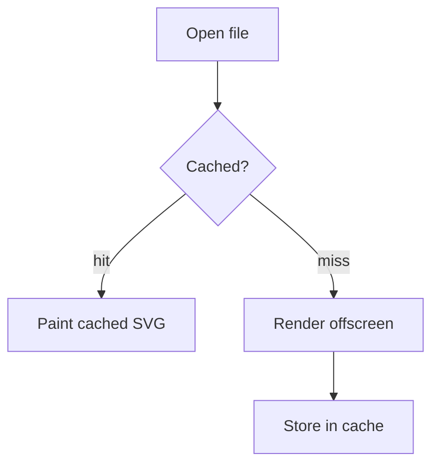
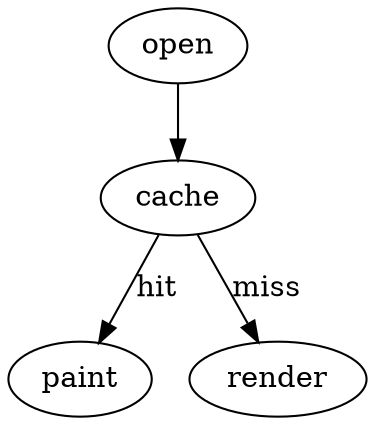

# Diagram render cache (task 184)

Three distinct d2 diagrams — a multi-diagram doc so we can prove reopening serves each
from the host cache with zero engine render, and that editing one never evicts the others.

```d2
alpha: Alpha Service
store: Alpha Store
alpha -> store: write
store -> alpha: ack
```

```d2
beta: Beta Gateway
queue: Beta Queue
beta -> queue: enqueue
queue -> beta: drain
```

```d2
gamma: Gamma Worker
cache: Gamma Cache
gamma -> cache: lookup
cache -> gamma: value
```

Vditor-NATIVE SVG engines (task 184 Phase 3) — reserved on open, served from cache with zero fresh
render on reopen: mermaid, graphviz, abc, flowchart.





```abc
X:1
T:Cache Tune
M:4/4
K:C
CDEF GABc|
```

```flowchart
open=>start: Open file
cache=>condition: Cached?
paint=>operation: Paint cached SVG
render=>operation: Render offscreen
open->cache
cache(yes)->paint
cache(no)->render
```

End.
