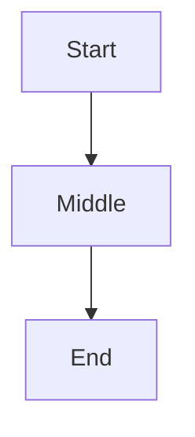
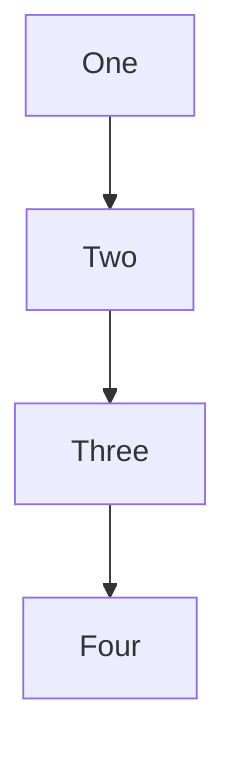

# Diagram re-settle spike

Prose before the diagrams.

```mermaid
graph TD
  A1[Start] --> B1[Middle] --> C1[End]
```

Prose between one and two.

```mermaid
graph LR
  A2[Alpha] --> B2[Beta] --> C2[Gamma] --> D2[Delta]
```

Prose between two and three.

```mermaid
graph TD
  A3[One] --> B3[Two]
  B3 --> C3[Three]
  C3 --> D3[Four]
```

Prose after the diagrams.
