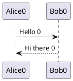
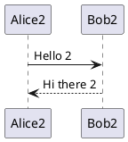
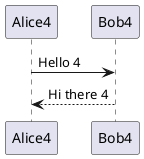

# Diagram retheme viewport gating (task 412)

## Section 0

Prose paragraph adding vertical height so most diagrams sit far below the fold. Prose paragraph adding vertical height so most diagrams sit far below the fold. Prose paragraph adding vertical height so most diagrams sit far below the fold. Prose paragraph adding vertical height so most diagrams sit far below the fold.



## Section 1

Prose paragraph adding vertical height so most diagrams sit far below the fold. Prose paragraph adding vertical height so most diagrams sit far below the fold. Prose paragraph adding vertical height so most diagrams sit far below the fold. Prose paragraph adding vertical height so most diagrams sit far below the fold.

```d2
api1: API 1
db1: {shape: cylinder}
api1 -> db1: query 1
```

## Section 2

Prose paragraph adding vertical height so most diagrams sit far below the fold. Prose paragraph adding vertical height so most diagrams sit far below the fold. Prose paragraph adding vertical height so most diagrams sit far below the fold. Prose paragraph adding vertical height so most diagrams sit far below the fold.



## Section 3

Prose paragraph adding vertical height so most diagrams sit far below the fold. Prose paragraph adding vertical height so most diagrams sit far below the fold. Prose paragraph adding vertical height so most diagrams sit far below the fold. Prose paragraph adding vertical height so most diagrams sit far below the fold.

```echarts
{
  "title": { "text": "ECharts demo 3" },
  "tooltip": {},
  "xAxis": { "type": "category", "data": ["Mon","Tue","Wed"] },
  "yAxis": { "type": "value" },
  "series": [{ "type": "bar", "data": [5, 20, 36] }]
}
```

## Section 4

Prose paragraph adding vertical height so most diagrams sit far below the fold. Prose paragraph adding vertical height so most diagrams sit far below the fold. Prose paragraph adding vertical height so most diagrams sit far below the fold. Prose paragraph adding vertical height so most diagrams sit far below the fold.



## Section 5

Prose paragraph adding vertical height so most diagrams sit far below the fold. Prose paragraph adding vertical height so most diagrams sit far below the fold. Prose paragraph adding vertical height so most diagrams sit far below the fold. Prose paragraph adding vertical height so most diagrams sit far below the fold.

```d2
api5: API 5
db5: {shape: cylinder}
api5 -> db5: query 5
```

## Section 6

Prose paragraph adding vertical height so most diagrams sit far below the fold. Prose paragraph adding vertical height so most diagrams sit far below the fold. Prose paragraph adding vertical height so most diagrams sit far below the fold. Prose paragraph adding vertical height so most diagrams sit far below the fold.


## Section 7

Prose paragraph adding vertical height so most diagrams sit far below the fold. Prose paragraph adding vertical height so most diagrams sit far below the fold. Prose paragraph adding vertical height so most diagrams sit far below the fold. Prose paragraph adding vertical height so most diagrams sit far below the fold.

```d2
api7: API 7
db7: {shape: cylinder}
api7 -> db7: query 7
```
