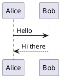

# Diagram sizing audit A — task 355

Baseline fixture for the holistic sizing/font pass. One representative block per renderer FAMILY,
each small enough that the sizing rule (not the content) decides the rendered size. Both PlantUML
cases are present on purpose: the pure-VECTOR one takes the `min-width:300px` boost, the SPRITE one
is excluded from it by `svg:not(:has(image))` — the pair that task 354 split and task 355 must judge.

Prose line for the font-size reference: labels inside a diagram should read in a sensible relation to
this paragraph, which is set in the content theme's body font at the column width.

Heavy engines: both PlantUML cases (the task-355 core: vector boost vs sprite natural size).

## plantuml — pure vector (takes the 300px boost)



## plantuml — sprite / icon library (excluded from the boost, natural size)

```plantuml
@startuml
!include <k8s/Common>
!include <k8s/OSS/KubernetesSvc>
!include <k8s/OSS/KubernetesPod>
Namespace_Boundary(ns, "Back End") {
  KubernetesSvc(svc, "service", "")
  KubernetesPod(pod, "pod", "")
}
@enduml
```
