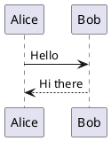
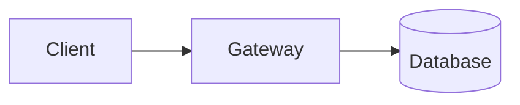
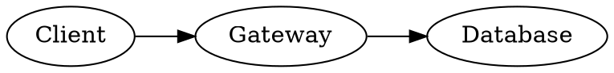

# Diagram sizing audit — task 355

Baseline fixture for the holistic sizing/font pass. One representative block per renderer FAMILY,
each small enough that the sizing rule (not the content) decides the rendered size. Both PlantUML
cases are present on purpose: the pure-VECTOR one takes the `min-width:300px` boost, the SPRITE one
is excluded from it by `svg:not(:has(image))` — the pair that task 354 split and task 355 must judge.

Prose line for the font-size reference: labels inside a diagram should read in a sensible relation to
this paragraph, which is set in the content theme's body font at the column width.

## plantuml — pure vector (takes the 300px boost)



## plantuml — sprite / icon library (excluded from the boost, natural size)

```plantuml
@startuml
!include <k8s/Common>
!include <k8s/OSS/KubernetesSvc>
!include <k8s/OSS/KubernetesPod>
Namespace_Boundary(ns, "Back End") {
  KubernetesSvc(svc, "service", "")
  KubernetesPod(pod, "pod", "")
}
@enduml
```

## mermaid — intrinsic size



## graphviz — intrinsic size



## flowchart — natural, shrink-only

```flowchart
st=>start: Start
op=>operation: Process
e=>end: End
st->op->e
```

## d2

```d2
api -> server: request
db: {shape: cylinder}
server -> db
```

## nomnoml

```nomnoml
[Pirate|eyeCount: Int|raid();pillage()]
[Pirate] -> [Ship]
```

## wavedrom

```wavedrom
{ "signal": [{ "name": "clk", "wave": "p......." }, { "name": "dat", "wave": "x.345x.." }] }
```

## vega-lite

```vega-lite
{"$schema":"https://vega.github.io/schema/vega-lite/v5.json","data":{"values":[{"a":"A","b":28},{"a":"B","b":55},{"a":"C","b":43}]},"mark":"bar","encoding":{"x":{"field":"a","type":"nominal"},"y":{"field":"b","type":"quantitative"}},"width":200,"height":120}
```

## abc — no viewBox, shrink-only

```abc
X:1
T:Scale
M:4/4
K:C
CDEF GABc|
```

## smiles — capped at 56% of the column

```smiles
CN1C=NC2=C1C(=O)N(C)C(=O)N2C
```

## echarts — sizes to the container

```echarts
{"xAxis":{"type":"category","data":["A","B","C"]},"yAxis":{"type":"value"},"series":[{"data":[120,200,150],"type":"bar"}]}
```

## markmap — sizes to the container

```markmap
- root
  - branch one
  - branch two
```

## mindmap — sizes to the container

```mindmap
- root
  - branch one
  - branch two
```
