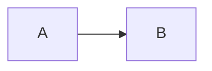

Before paragraph.



```markmap
# root
## a
## b
```

```mindmap
# root
## a
## b
```

```geojson
{"type": "Polygon", "coordinates": [[[-5, -5], [5, -5], [5, 5], [-5, 5], [-5, -5]]]}
```

After paragraph.
