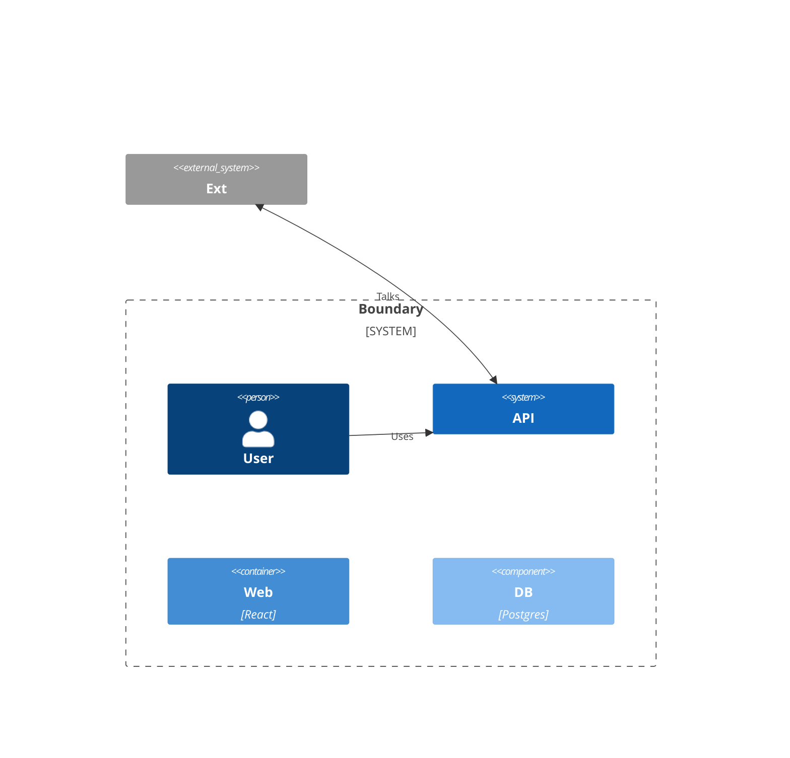

# Mermaid C4 palette fixture

```mermaid
C4Context
System_Boundary(b1, "Boundary") {
  Person(user, "User")
  System(api, "API")
  Container(web, "Web", "React")
  Component(db, "DB", "Postgres")
}
System_Ext(ext, "Ext")
Rel(user, api, "Uses")
BiRel(api, ext, "Talks")
```
