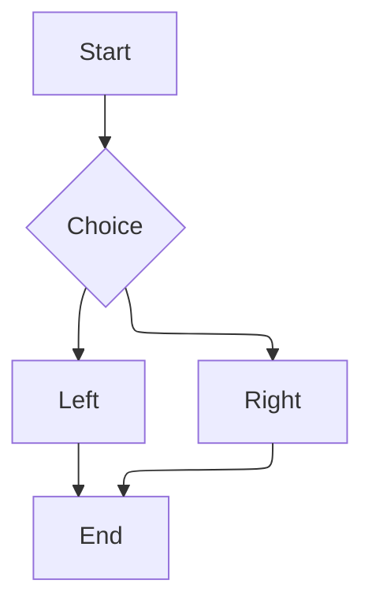

# Mermaid per-diagram ELK directive (task 112)

The GLOBAL setting stays dagre, but this diagram opts itself into ELK via `%%{init:{"layout":"elk"}}%%`.
main.ts's `docRequestsMermaidElk` pre-scan must spot it on open and load+register the adapter so the
directive is honored (no "layout loader missing" error).

