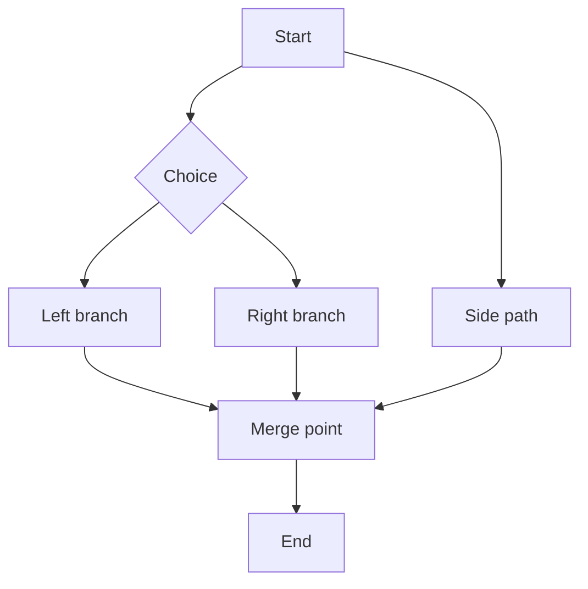

# Mermaid ELK layout fixture (task 112)

A branching graph: dagre and ELK lay it out measurably differently, so a geometry diff proves ELK
actually drove the layout (not a silent dagre fallback). Layout is chosen by the
`vmarkd.diagram.mermaid.layout` setting — no per-diagram directive here.

