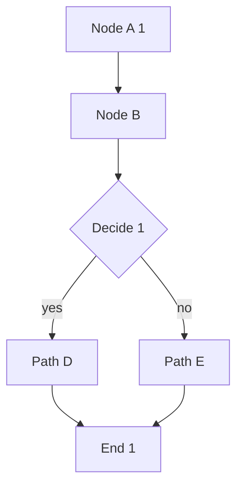
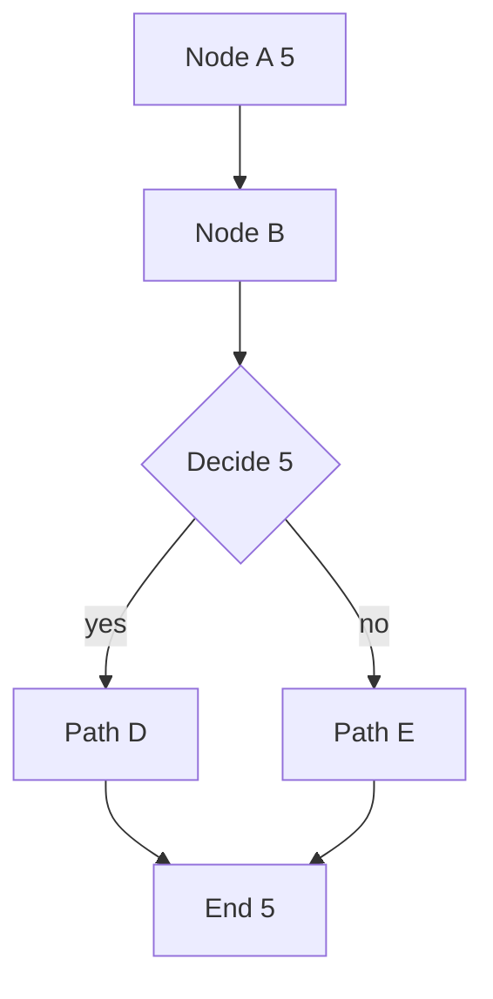
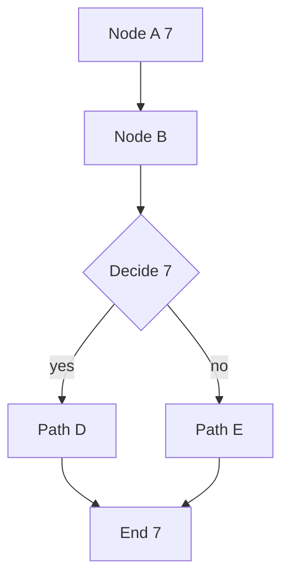
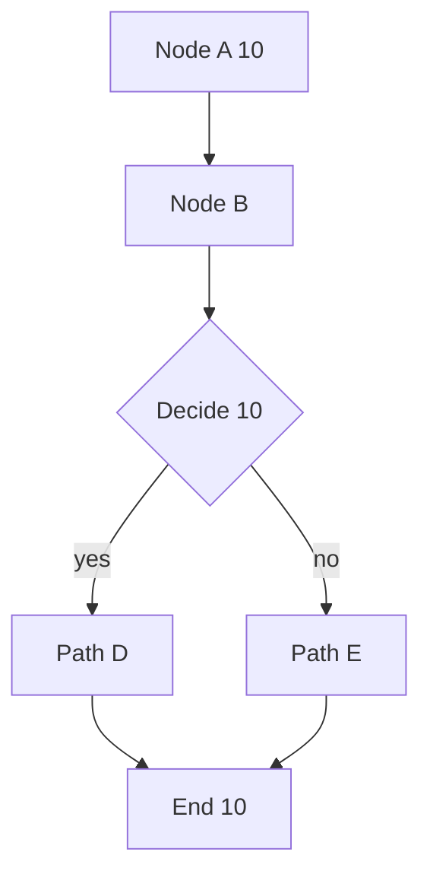
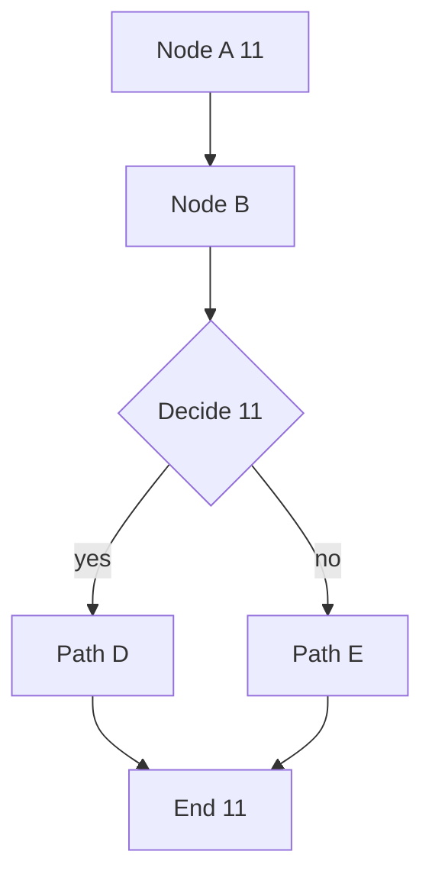

# Mermaid theme-flip viewport gating (task 166)

## Section 0

Prose paragraph adding vertical height so most diagrams sit far below the fold. Prose paragraph adding vertical height so most diagrams sit far below the fold. Prose paragraph adding vertical height so most diagrams sit far below the fold. Prose paragraph adding vertical height so most diagrams sit far below the fold. 

## Section 1

Prose paragraph adding vertical height so most diagrams sit far below the fold. Prose paragraph adding vertical height so most diagrams sit far below the fold. Prose paragraph adding vertical height so most diagrams sit far below the fold. Prose paragraph adding vertical height so most diagrams sit far below the fold. 

## Section 2

Prose paragraph adding vertical height so most diagrams sit far below the fold. Prose paragraph adding vertical height so most diagrams sit far below the fold. Prose paragraph adding vertical height so most diagrams sit far below the fold. Prose paragraph adding vertical height so most diagrams sit far below the fold. 

## Section 3

Prose paragraph adding vertical height so most diagrams sit far below the fold. Prose paragraph adding vertical height so most diagrams sit far below the fold. Prose paragraph adding vertical height so most diagrams sit far below the fold. Prose paragraph adding vertical height so most diagrams sit far below the fold. 

## Section 4

Prose paragraph adding vertical height so most diagrams sit far below the fold. Prose paragraph adding vertical height so most diagrams sit far below the fold. Prose paragraph adding vertical height so most diagrams sit far below the fold. Prose paragraph adding vertical height so most diagrams sit far below the fold. 

## Section 5

Prose paragraph adding vertical height so most diagrams sit far below the fold. Prose paragraph adding vertical height so most diagrams sit far below the fold. Prose paragraph adding vertical height so most diagrams sit far below the fold. Prose paragraph adding vertical height so most diagrams sit far below the fold. 

## Section 6

Prose paragraph adding vertical height so most diagrams sit far below the fold. Prose paragraph adding vertical height so most diagrams sit far below the fold. Prose paragraph adding vertical height so most diagrams sit far below the fold. Prose paragraph adding vertical height so most diagrams sit far below the fold. 

## Section 7

Prose paragraph adding vertical height so most diagrams sit far below the fold. Prose paragraph adding vertical height so most diagrams sit far below the fold. Prose paragraph adding vertical height so most diagrams sit far below the fold. Prose paragraph adding vertical height so most diagrams sit far below the fold. 

## Section 8

Prose paragraph adding vertical height so most diagrams sit far below the fold. Prose paragraph adding vertical height so most diagrams sit far below the fold. Prose paragraph adding vertical height so most diagrams sit far below the fold. Prose paragraph adding vertical height so most diagrams sit far below the fold. 

## Section 9

Prose paragraph adding vertical height so most diagrams sit far below the fold. Prose paragraph adding vertical height so most diagrams sit far below the fold. Prose paragraph adding vertical height so most diagrams sit far below the fold. Prose paragraph adding vertical height so most diagrams sit far below the fold. 

## Section 10

Prose paragraph adding vertical height so most diagrams sit far below the fold. Prose paragraph adding vertical height so most diagrams sit far below the fold. Prose paragraph adding vertical height so most diagrams sit far below the fold. Prose paragraph adding vertical height so most diagrams sit far below the fold. 

## Section 11

Prose paragraph adding vertical height so most diagrams sit far below the fold. Prose paragraph adding vertical height so most diagrams sit far below the fold. Prose paragraph adding vertical height so most diagrams sit far below the fold. Prose paragraph adding vertical height so most diagrams sit far below the fold. 

