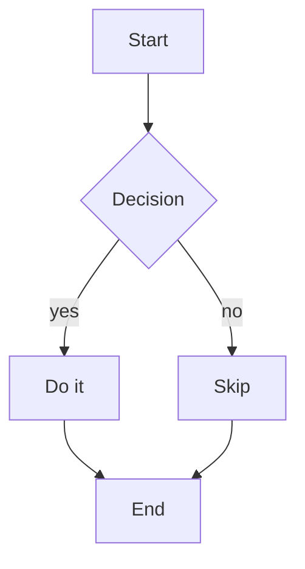

# Mermaid label edit repro

Typing inside a node label of a rendered mermaid graph (user repro: "Do itssssssss").

```mermaid
graph TD
  A[Start] --> B{Decision}
  B -->|yes| C[Do it]
  B -->|no| D[Skip]
  C --> E[End]
  D --> E
```
