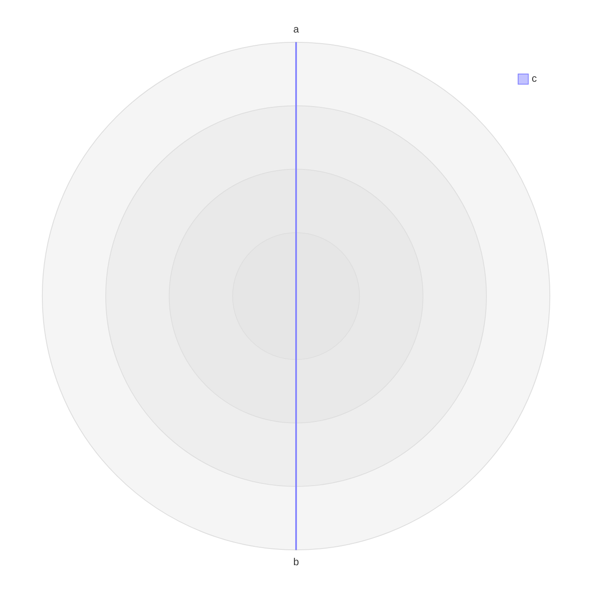

```mermaid
architecture-beta
  group mermaidPrototypePollutionMarker(cloud)[Marker]
  group __proto__(cloud)[Proto]
  service a(server)[A] in __proto__
  service b(server)[B] in mermaidPrototypePollutionMarker
  a:R -- L:b
```

```mermaid
xychart-beta
  x-axis [1, 2, 3]
  line [1, 2, 3]
```


