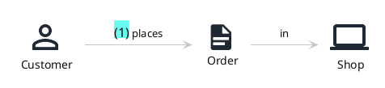

# domainstory — ikony z dostarczonej biblioteki material (task 384)

Bez żadnych ręcznych sprite'ów: `!include <DomainStory/domainStory>` i tyle.

```plantuml
@startuml
!include <DomainStory/domainStory>
Person(customer, "Customer")
Document(order, "Order")
System(shop, "Shop")
activity(1, customer, places, order, "in", shop)
@enduml
```
