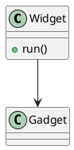
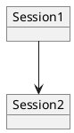
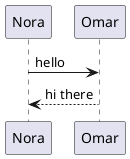
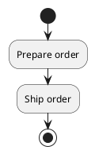
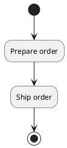
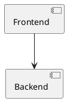
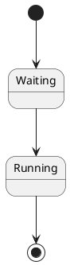
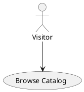
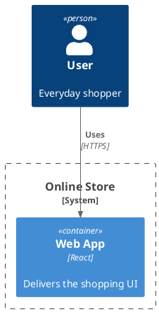

# PlantUML diagram-family matrix (task 429)

One class diagram + eight non-class families in render order, all with labels deliberately free of
any standalone "A"/"C"/"I"/"E" word (see `plantuml-word-boundary-misread.md` for why that matters —
PlantUML wraps a multi-word label into one `<text>` per WORD, and a bare single-letter word there
trips `renderedIsClass`'s circled-icon heuristic). This fixture is the CLEAN half of the audit:
`isClassSource` routing across the family matrix, with nothing else able to confuse the safety net.

