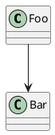
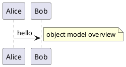
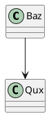
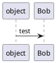
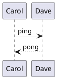

# PlantUML free-text / bare-keyword-participant misread (task 429 adversarial-review finding)

`isClassSource`'s keyword check had two more false-positive shapes beyond the `object`-keyword miss
(see `plantuml-family-matrix.md`): a class-diagram keyword appearing at the start of a free-text
block BODY (`note`/`legend`/`title`/…) reads as a declaration even though it's prose, and a bare
keyword used as an unquoted participant NAME in a message line reads as a declaration even though
it's a message subject. Both poison the SAME direction as the `object` bug — a non-class source
misrouted to the shared `class` engine renders visibly wrong (spurious circled icons) when that
instance is primed from a real class diagram right before it. This fixture interleaves real class
diagrams around both false-positive shapes so the poisoning would be visible if the fix regressed.

