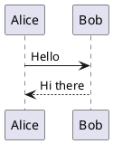

# PlantUML loading placeholder (task 139)

A single PlantUML block so the FIRST render in the webview is cold — the engine lazy-loads (~1s),
during which the block shows the "Rendering PlantUML…" placeholder, then swaps to the SVG.

