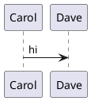

# PlantUML — an include that cannot resolve offline (task 384)

A stdlib library we do not vendor. The diagram still renders; the note is what tells
you its icons/macros are gone.

```plantuml
@startuml
!include <nosuchlib/NoSuchFile>
Alice -> Bob : hello
@enduml
```

A plain diagram, for contrast — it must carry NO note.


