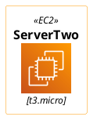
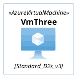
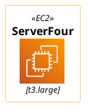
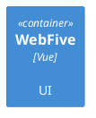

# PlantUML multi-block stress (task 347)

Five icon diagrams (C4 / AWS / Azure, all non-class) in one document — the exact shape that used to
flake with a random "Assumed diagram type: sequence" on the shared TeaVM engine.

