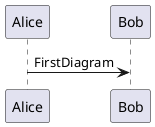

# PlantUML multi-diagram note (task 140)

Two `@startuml…@enduml` in ONE fence — the engine renders only the first; the note flags the rest.

```plantuml
@startuml
Alice -> Bob : FirstDiagram
@enduml
@startuml
Carol -> Dave : SecondDiagram
@enduml
```
