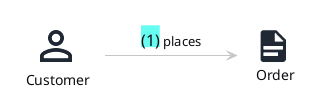
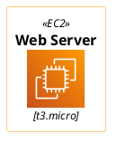
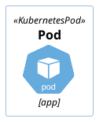

# PlantUML stdlib on a dark theme — library-native vs compensated (task 384)

`domainstory` and `awslib` read `PUML_MODE` and theme themselves; `k8s` does not and keeps our
light-page compensation.

