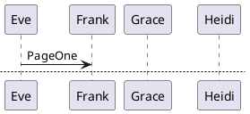

# PlantUML newpage (task 140)

`newpage` paginates within ONE `@startuml` — the engine renders ALL pages, so NO note.

```plantuml
@startuml
Eve -> Frank : PageOne
newpage
Grace -> Heidi : PageTwo
@enduml
```
