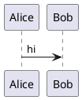
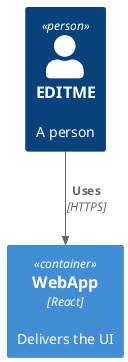

# PlantUML rapid-edit convergence (task 349)

A warmup block (warms the shared engine so the C4 edit below is a warm render).

A C4 diagram (~2.2 s render) with an editable label. The test rapidly grows `EDITME` and asserts the
diagram converges to the LAST edit in bounded time — under the pre-fix backlog each spaced keystroke
queued a full render that clogged the serialised queue, so the correct final render arrived tens of
seconds late.

