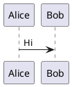

# PlantUML resize fixture

A small plantuml diagram — narrow enough that nothing clamps it to the column, so it exercises both
the keep-last overlay size-match (no shrink/jump while editing) and the task-355 settled sizing
(uniform 14 layout font, no scale, labels at prose size).

