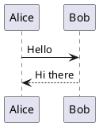

# PlantUML sizing — vector vs sprite

Guard fixture for the task-354 sizing split. The two PlantUML cases must sit in ONE document so the
same column width and the same render pass apply to both.

The first diagram is pure VECTOR (no `<image>`): `main.css` boosts it via
`.language-plantuml > svg:not(:has(image)) { min-width: 300px }`.



The second uses a stdlib ICON library, so PlantUML emits bitmap `<image>` sprites. Boosting those
past their intrinsic size upscales and blurs them — which is why the boost excludes `:has(image)`.

```plantuml
@startuml
!include <k8s/Common>
!include <k8s/OSS/KubernetesSvc>
!include <k8s/OSS/KubernetesPod>
Namespace_Boundary(ns, "Back End") {
  KubernetesSvc(svc, "service", "")
  KubernetesPod(pod, "pod", "")
}
@enduml
```
