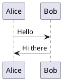

# PlantUML sizing — vector vs sprite

Guard fixture for the task-354 sizing split. The two PlantUML cases must sit in ONE document so the
same column width and the same render pass apply to both.

The first diagram is pure VECTOR (no `<image>`): we inject our palette + layout font into it, and it
renders at its intrinsic size (task 355).



The second uses a stdlib ICON library, so PlantUML emits bitmap `<image>` sprites. It themes itself,
so our font/scale pass skips it entirely — and it must never be upscaled: that blurs the sprites.

```plantuml
@startuml
!include <k8s/Common>
!include <k8s/OSS/KubernetesSvc>
!include <k8s/OSS/KubernetesPod>
Namespace_Boundary(ns, "Back End") {
  KubernetesSvc(svc, "service", "")
  KubernetesPod(pod, "pod", "")
}
@enduml
```
