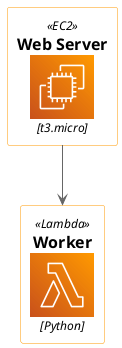

# Synthesized `<awslib/…/all>` aggregator (task 136, option C)

`<awslib/Compute/all>` is NOT vendored — it is SYNTHESIZED from the ~38 individual
`<awslib/Compute/*>` icons we do vendor. If EC2 (one of those icons) renders, the
synthesis pulled the whole category correctly.

