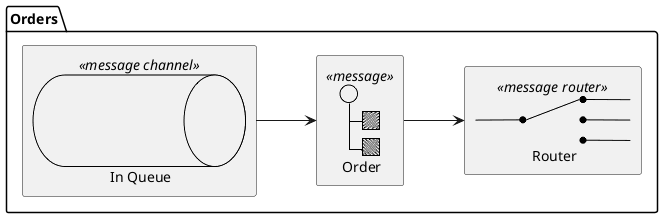
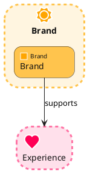
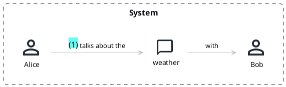
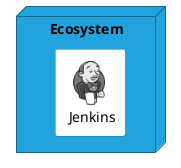
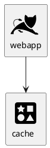
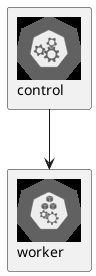

# PlantUML stdlib icon libs — task 354 (offline)

Seven MIT/Apache icon libraries vendored from the plantuml-stdlib aggregator. Each `!include <lib/…>`
must resolve OFFLINE (no "Fatal parsing error", no "not found offline" note). k8s additionally proves the
transitive `<C4/C4>` dependency loads (STDLIB_DEPS), even though the source never names C4.

k8s — `!include <k8s/…>` (builds on C4):

```plantuml
@startuml
!include <k8s/Common>
!include <k8s/OSS/KubernetesSvc>
!include <k8s/OSS/KubernetesPod>
Namespace_Boundary(ns, "Back End") {
  KubernetesSvc(svc, "service", "")
  KubernetesPod(pod, "pod", "")
}
@enduml
```

eip — `!include <eip/…>`:



edgy — `!include <edgy/…>`:



DomainStory — `!include <DomainStory/…>` (mixed-case prefix):



cloudogu — `!include <cloudogu/…>`:



cloudinsight — `!include <cloudinsight/…>`:



kubernetes — `!include <kubernetes/…>` (sprite sheet):


