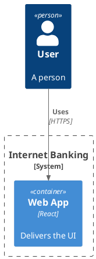
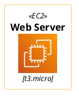
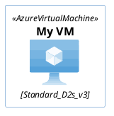

# PlantUML stdlib includes (task 136)

C4 — `!include <C4/…>`:

```plantuml
@startuml
!include <C4/C4_Container>
Person(user, "User", "A person")
' The boundary is load-bearing for task 382: it is drawn as a rect with a `#00000000` (transparent)
' fill, and a theming pass that mistakes that for the darkest ink paints it SOLID over the diagram.
System_Boundary(c1, "Internet Banking") {
  Container(web, "Web App", "React", "Delivers the UI")
}
Rel(user, web, "Uses", "HTTPS")
@enduml
```

AWS icons — `!include <awslib/…>`:

```plantuml
@startuml
!include <awslib/AWSCommon>
!include <awslib/Compute/EC2>
EC2(web, "Web Server", "t3.micro")
@enduml
```

Azure icons — `!include <azure/…>`:

```plantuml
@startuml
!include <azure/AzureCommon>
!include <azure/Compute/AzureVirtualMachine>
AzureVirtualMachine(vm, "My VM", "Standard_D2s_v3")
@enduml
```
