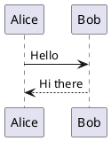
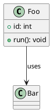
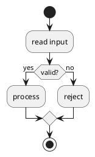

# PlantUML theme-flip regression

Three PlantUML blocks that bake their palette at render time, so a live theme flip must re-render them
— and must do so ONCE, not twice (the reThemeMono foreground poll used to double-fire).

