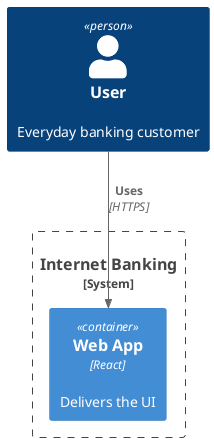
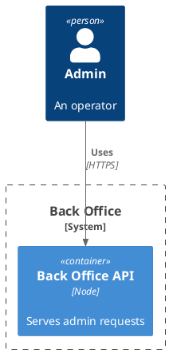

# PlantUML phase-timing fixture (task 430)

Two C4 diagrams, both `!include <C4/C4_Container>` (so `nonClass`, per `isClassSource`). Different
diagram text (different `data-code` hash) so the SECOND block is not a render-cache hit of the first
— but it DOES reuse the already-warm `nonClass` engine instance and the already-loaded C4 stdlib
file-map, so its `engineImport` phase should read near-zero while `stdlibExpand` (textual expansion
only, no `loadScript`) and `engineRender` are still paid close to in full. That is the "engine-warm"
data point the phase-timing spec pairs against a genuine disk-cache HIT (produced separately, by
closing and re-opening this same file — see `abc-flip-cache-hit.spec.ts` for the proven pattern).

