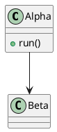
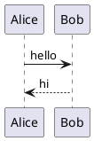
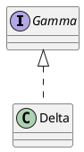
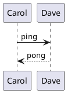

# PlantUML class↔non-class type switch (task 178 dual-instance)

Interleaved class and sequence diagrams in render order (class → sequence → class → sequence) so the
render queue crosses the sticky-type boundary three times. Each block must render as ITS OWN type — a
sequence block rendered right after a class block proves the class engine's type-state did not leak.

