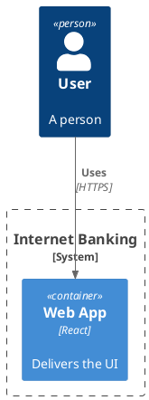
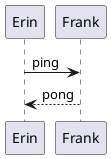

# PlantUML word-boundary misread of `renderedIsClass` (task 429 finding)

Both blocks are `nonClass` per `isClassSource` (no class keyword, no class relation operator, no bare
association — see plantuml-render.ts). The FIRST block's Person description ("A person") is short
enough to fit on one line by eye, but PlantUML lays out a C4 descriptor as one `<text>` element PER
WORD (verified: `Person(user, "User", "A person")` renders as separate `<text>` nodes "Web"/" "/"App"-
style, one of them being the bare word "A") — and `renderedIsClass`'s circled-icon heuristic is
`/^[CIEA]$/` on EVERY `<text>` in the SVG, with no structural check that it's actually the type icon.
A stray one-letter WORD (the English article "A", or a stray "C"/"I"/"E") anywhere in a diagram's text
therefore reads as a class/interface/enum/abstract icon even on a diagram with none — false-positive
discarding the correctly-chosen `nonClass` engine instance. The second block (plain sequence, also
nonClass) is what makes the cost visible: it re-imports the engine the first block just discarded.

