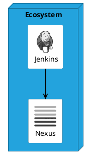

# cloudogu probe

A — as our demo files write it (explicit white card):

```plantuml
@startuml
!include <cloudogu/common>
!include <cloudogu/dogus/jenkins>
!include <cloudogu/dogus/nexus>
node "Ecosystem" <<$cloudogu>> {
  DOGU_JENKINS(jenkins, Jenkins) #ffffff
  DOGU_NEXUS(nexus, Nexus) #ffffff
}
jenkins --> nexus
@enduml
```

B — plain, no explicit card colour (library's own PRIMARY_COLOR):

```plantuml
@startuml
!include <cloudogu/common>
!include <cloudogu/dogus/jenkins>
!include <cloudogu/dogus/cas>
DOGU_JENKINS(jenkins, Jenkins)
DOGU_CAS(cas, CAS)
jenkins --> cas
@enduml
```
