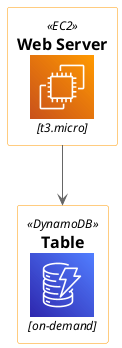
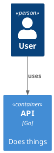

# probe: does one injected PUML_MODE line reach every library that reads it?

`awslib` tests `%variable_exists("$PUML_MODE") && $PUML_MODE == "dark"`; `domainstory` tests bare
`PUML_MODE == "light"`. If the `$` prefix is just syntax sugar, ONE injected line covers both.

Block 0 — awslib baseline.

Block 1 — awslib with the BARE name.

Block 2 — awslib with the `$` name.

Block 3 — domainstory with the `$` name (its own test is on the bare name).

Block 4 — C4, which reads neither, as a control that the injected line is inert there.

