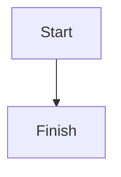
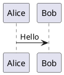
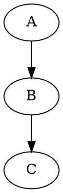

# Remaining vendor upgrades



```d2
direction: right
api: API
db: {shape: cylinder}
api -> db: query
```

```vega-lite
{"data":{"values":[{"x":"A","y":1},{"x":"B","y":2}]},"mark":"bar","encoding":{"x":{"field":"x","type":"nominal"},"y":{"field":"y","type":"quantitative"}}}
```

```vega
{"width":160,"height":90,"data":[{"name":"table","values":[{"x":10,"y":10},{"x":80,"y":50}]}],"marks":[{"type":"symbol","from":{"data":"table"},"encode":{"enter":{"x":{"field":"x"},"y":{"field":"y"}}}}]}
```

```stl
solid triangle
 facet normal 0 0 1
  outer loop
   vertex 0 0 0
   vertex 1 0 0
   vertex 0 1 0
  endloop
 endfacet
endsolid triangle
```

```abc
X:1
T:Scale
M:4/4
K:C
C D E F | G A B c |
```

```smiles
CCO
```

```wavedrom
{"signal":[{"name":"clk","wave":"p..."},{"name":"data","wave":"x.34"}]}
```

```flowchart
st=>start: Start
op=>operation: Work
e=>end: End
st->op->e
```




