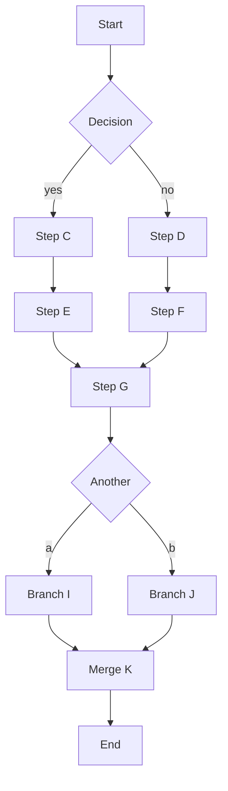

# Render cost spike

A heavier mermaid graph (more nodes → more dagre layout work):



A d2 diagram (WASM compile + ELK layout on the main thread):

```d2
server: Web Server
db: Database
cache: Redis Cache
client: Client
client -> server: request
server -> cache: check
cache -> server: miss
server -> db: query
db -> server: rows
server -> client: response
```

End.
